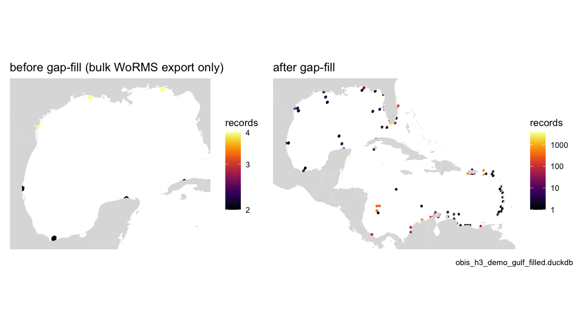
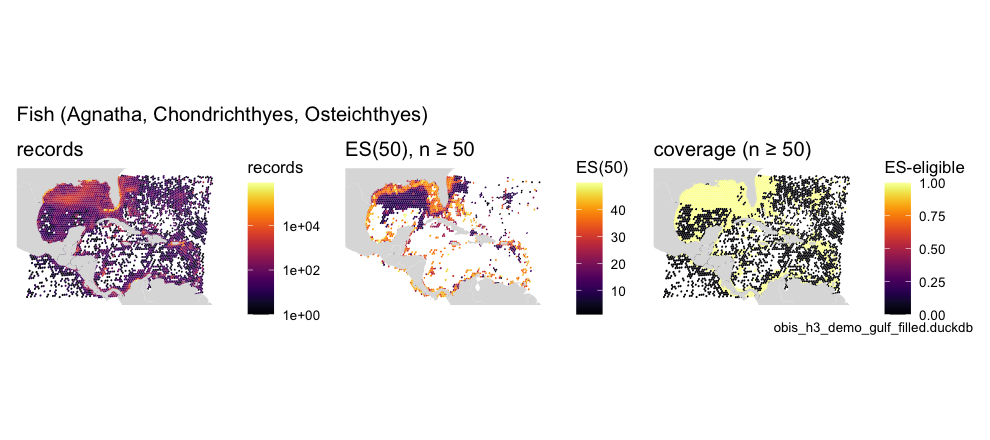
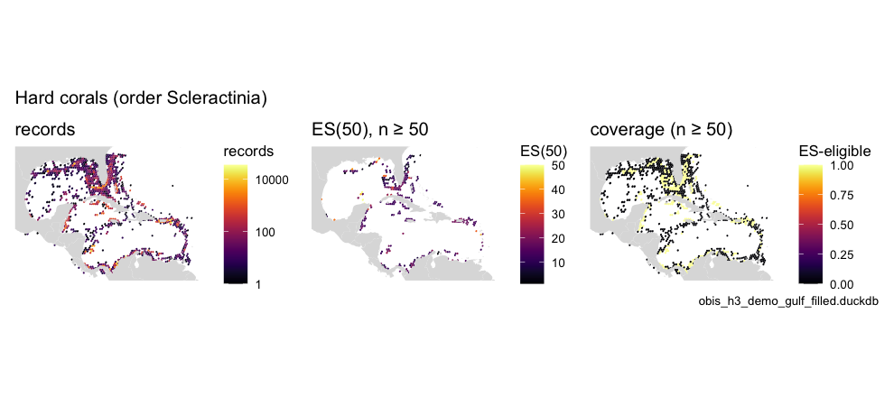
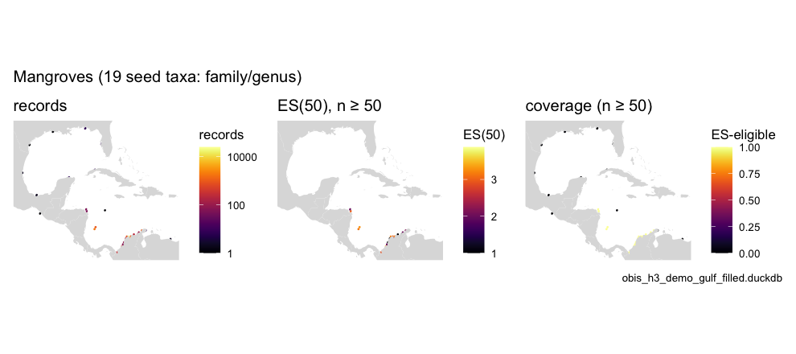
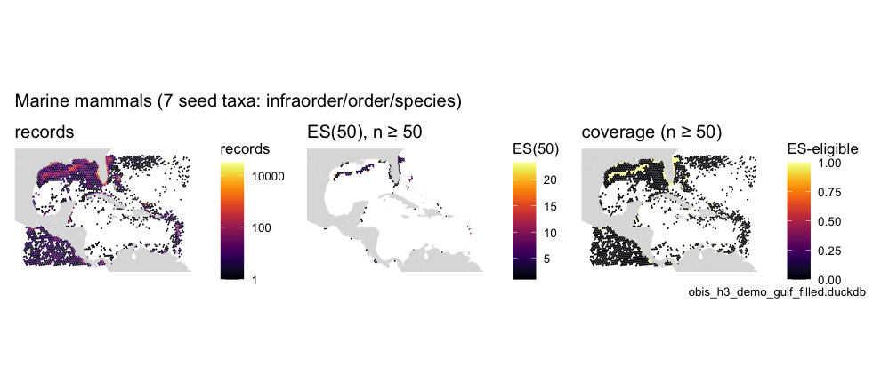
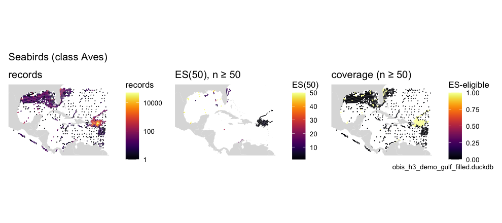
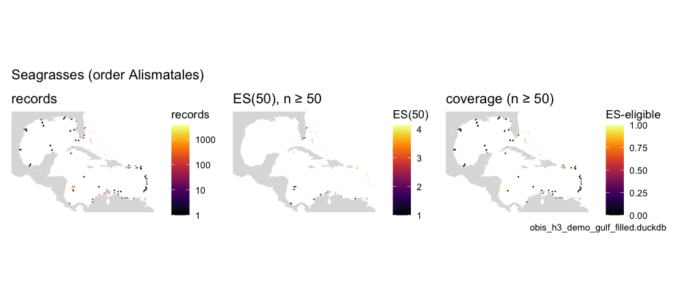
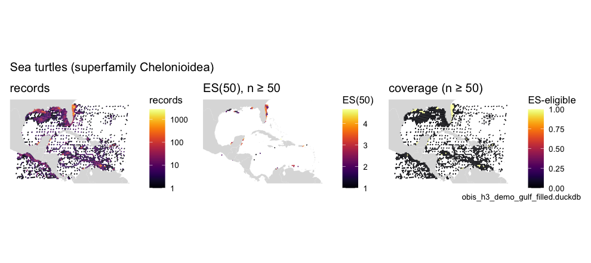
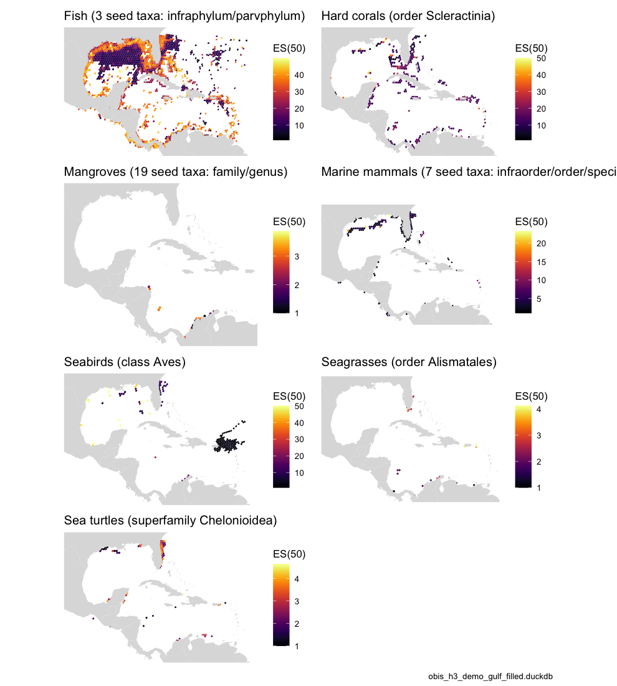

# Essential Ocean Variables from the OBIS store

The GOOS / IOOS biology & ecosystems **Essential Ocean Variables**
(EOVs) are defined taxonomically, and the [IOOS Marine Life Data
Network](https://github.com/ioos/marine_life_data_network/tree/main/eov_taxonomy)
publishes that definition as root WoRMS AphiaIDs per EOV — 33 seeds
across seven EOVs: fish, hard corals, mangroves, marine mammals,
seabirds, seagrasses and sea turtles. That is exactly a multi-seed
version of the subtree walk in
[`vignette("taxon_children")`](https://marinebon.org/obisindicators/articles/taxon_children.md),
so an EOV map from the `obis_h3` store is one query away. This article
shows the definitions, the taxonomy coverage gap that silently empties
EOVs unless it is closed, and the per-EOV maps — Table 4 and Figures 1–2
of the OBIS → H3 → EOV manuscript.

``` r

library(obisindicators)
library(dplyr)
library(ggplot2)

con <- obis_store_connect()   # the store named by OBIS_H3_DUCKDB
```

> **Precomputed.** The store is not available where this documentation
> is built, so the chunks below were run locally by
> `data-raw/precompute_articles.R` and their output committed. This
> render used **obis_h3_demo_gulf_filled.duckdb**, a regional demo store
> (Gulf of Mexico + Caribbean, see `paper/build_demo_store.R`);
> before/after comparisons use **obis_h3_demo_gulf.duckdb**.

## The definitions

[`obis_eov_seeds()`](https://marinebon.org/obisindicators/reference/obis_eov_seeds.md)
returns the seed AphiaIDs per EOV;
[`obis_eov_label()`](https://marinebon.org/obisindicators/reference/obis_eov_label.md)
turns an EOV key into a readable label;
[`obis_eov_aphiaid()`](https://marinebon.org/obisindicators/reference/obis_eov_aphiaid.md)
gives the seeds to pass wherever an `aphiaid` filter is accepted.

``` r

knitr::kable(obis_eov_seeds(), caption = "EOV seed taxa (IOOS MLDN eov_taxonomy)")
```

| eov | label | desc | aphiaid | taxon | rank |
|:---|:---|:---|---:|:---|:---|
| fish | Fish | All fishes: jawless, cartilaginous and bony. | 1829 | Agnatha | Infraphylum |
| fish | Fish | All fishes: jawless, cartilaginous and bony. | 1517375 | Chondrichthyes | Parvphylum |
| fish | Fish | All fishes: jawless, cartilaginous and bony. | 152352 | Osteichthyes | Parvphylum |
| hardCorals | Hard corals | Reef-building stony corals. | 1363 | Scleractinia | Order |
| mangroves | Mangroves | Mangrove trees, shrubs and the mangrove fern, as 19 genera plus one family. | 235048 | Combretaceae | Family |
| mangroves | Mangroves | Mangrove trees, shrubs and the mangrove fern, as 19 genera plus one family. | 235033 | Avicennia | Genus |
| mangroves | Mangroves | Mangrove trees, shrubs and the mangrove fern, as 19 genera plus one family. | 234450 | Nypa | Genus |
| mangroves | Mangroves | Mangrove trees, shrubs and the mangrove fern, as 19 genera plus one family. | 234495 | Bruguiera | Genus |
| mangroves | Mangroves | Mangrove trees, shrubs and the mangrove fern, as 19 genera plus one family. | 235086 | Ceriops | Genus |
| mangroves | Mangroves | Mangrove trees, shrubs and the mangrove fern, as 19 genera plus one family. | 235089 | Kandelia | Genus |
| mangroves | Mangroves | Mangrove trees, shrubs and the mangrove fern, as 19 genera plus one family. | 235091 | Rhizophora | Genus |
| mangroves | Mangroves | Mangrove trees, shrubs and the mangrove fern, as 19 genera plus one family. | 235106 | Sonneratia | Genus |
| mangroves | Mangroves | Mangrove trees, shrubs and the mangrove fern, as 19 genera plus one family. | 235056 | Excoecaria | Genus |
| mangroves | Mangroves | Mangrove trees, shrubs and the mangrove fern, as 19 genera plus one family. | 235060 | Pemphis | Genus |
| mangroves | Mangroves | Mangrove trees, shrubs and the mangrove fern, as 19 genera plus one family. | 235045 | Camptostemon | Genus |
| mangroves | Mangroves | Mangrove trees, shrubs and the mangrove fern, as 19 genera plus one family. | 235116 | Heritiera | Genus |
| mangroves | Mangroves | Mangrove trees, shrubs and the mangrove fern, as 19 genera plus one family. | 235063 | Xylocarpus | Genus |
| mangroves | Mangroves | Mangrove trees, shrubs and the mangrove fern, as 19 genera plus one family. | 235072 | Osbornia | Genus |
| mangroves | Mangroves | Mangrove trees, shrubs and the mangrove fern, as 19 genera plus one family. | 235075 | Pelliciera | Genus |
| mangroves | Mangroves | Mangrove trees, shrubs and the mangrove fern, as 19 genera plus one family. | 235077 | Aegialitis | Genus |
| mangroves | Mangroves | Mangrove trees, shrubs and the mangrove fern, as 19 genera plus one family. | 235068 | Aegiceras | Genus |
| mangroves | Mangroves | Mangrove trees, shrubs and the mangrove fern, as 19 genera plus one family. | 234488 | Acrostichum | Genus |
| mangroves | Mangroves | Mangrove trees, shrubs and the mangrove fern, as 19 genera plus one family. | 235103 | Scyphiphora | Genus |
| marineMammals | Marine mammals | Seals & sea lions, whales & dolphins, and sirenians, plus four individually-listed carnivores (sea otter, marine otter, North American river otter, polar bear). | 148736 | Pinnipedia | Infraorder |
| marineMammals | Marine mammals | Seals & sea lions, whales & dolphins, and sirenians, plus four individually-listed carnivores (sea otter, marine otter, North American river otter, polar bear). | 2688 | Cetacea | Infraorder |
| marineMammals | Marine mammals | Seals & sea lions, whales & dolphins, and sirenians, plus four individually-listed carnivores (sea otter, marine otter, North American river otter, polar bear). | 159502 | Sirenia | Order |
| marineMammals | Marine mammals | Seals & sea lions, whales & dolphins, and sirenians, plus four individually-listed carnivores (sea otter, marine otter, North American river otter, polar bear). | 242598 | Enhydra lutris | Species |
| marineMammals | Marine mammals | Seals & sea lions, whales & dolphins, and sirenians, plus four individually-listed carnivores (sea otter, marine otter, North American river otter, polar bear). | 477316 | Lutra felina | Species |
| marineMammals | Marine mammals | Seals & sea lions, whales & dolphins, and sirenians, plus four individually-listed carnivores (sea otter, marine otter, North American river otter, polar bear). | 159017 | Lontra canadensis | Species |
| marineMammals | Marine mammals | Seals & sea lions, whales & dolphins, and sirenians, plus four individually-listed carnivores (sea otter, marine otter, North American river otter, polar bear). | 137085 | Ursus maritimus | Species |
| seabirds | Seabirds | Class Aves entire - i.e. ALL birds, not a seabird-only subset. Against a marine-only snapshot that is a reasonable proxy, but it is a definitional choice made by the EOV list. | 1836 | Aves | Class |
| seagrasses | Seagrasses | Order Alismatales, the marine flowering plants (also takes in some brackish/freshwater pondweeds). | 153491 | Alismatales | Order |
| seaTurtles | Sea turtles | Marine turtles. | 987094 | Chelonioidea | Superfamily |

EOV seed taxa (IOOS MLDN eov_taxonomy) {.table}

``` r

obis_eov_label("marineMammals")
#>                                            marineMammals 
#> "Marine mammals (7 seed taxa: infraorder/order/species)"
obis_eov_aphiaid("seaTurtles")
#> [1] 987094
```

**Why seeds-and-subtree rather than the Darwin Core rank columns**: the
rank a name occupies is not stable, so a `class = <name>` filter
silently matches *nothing* when OBIS files the name elsewhere (Table 3
in
[`vignette("taxon_children")`](https://marinebon.org/obisindicators/articles/taxon_children.md)).
Subtree walking is rank-agnostic and immune.

[`obis_eov_sql()`](https://marinebon.org/obisindicators/reference/obis_eov_sql.md)
builds the tile SQL for an EOV. With one EOV and no year filter it
routes to the **precomputed** `idx_h3_eov` layer (as fast as the
all-taxa path); with years, several EOVs, or a store without the layer
baked it falls back to the live subtree aggregation over `occ_h3`.

``` r

cat(obis_eov_sql("seaTurtles"))
#> SELECT cell_id, es AS value, n FROM idx_h3_eov WHERE eov = 'seaTurtles' AND res = LEAST({{res}}, 7)
```

[`obis_eov_bake()`](https://marinebon.org/obisindicators/reference/obis_eov_bake.md)
adds the two layers to a store: `eov` (membership: each EOV’s seeds
expanded over `taxon`) and `idx_h3_eov` (indicators per EOV and
resolution 1–7).

## The taxonomy coverage gap

EOV membership is only as complete as the `taxon` table. The bulk WoRMS
download is **not** a complete cover of the AphiaIDs OBIS carries — on
the 2026-07 global store about 7% of distinct species-level AphiaIDs
(8.3 M of 121.9 M records) were absent, notably algae, whose WoRMS
records come from thematic databases the Darwin Core export lags. Every
one of those is invisible to every subtree, EOV and SPUE query until
[`obis_taxon_fill_gaps()`](https://marinebon.org/obisindicators/reference/obis_taxon_fill_gaps.md)
supplements the bulk join with WoRMS REST lookups, to transitive
closure.

[`obis_taxon_orphans()`](https://marinebon.org/obisindicators/reference/obis_taxon_orphans.md)
reports the gap on a store:

``` r

orph <- obis_taxon_orphans(con)
tibble(orphan_aphiaids = nrow(orph), orphan_records = sum(orph$records))
#> # A tibble: 1 × 2
#>   orphan_aphiaids orphan_records
#>             <int>          <dbl>
#> 1               0              0
head(arrange(orph, desc(records)), 10)
#> [1] taxonID records
#> <0 rows> (or 0-length row.names)
```

## Totals per EOV (Table 4)

``` r

tot <- calc_eov_totals(con)
knitr::kable(
  tot |> mutate(across(c(records, species, cells), ~ format(.x, big.mark = ",")),
                pct_records = round(pct_records, 2)),
  caption = "Records, species and occupied cells per EOV")
```

| eov           | label          | records   | species | cells  | pct_records |
|:--------------|:---------------|:----------|:--------|:-------|------------:|
| fish          | Fish           | 5,607,473 | 3,874   | 82,049 |       67.88 |
| hardCorals    | Hard corals    | 347,292   | 350     | 5,110  |        4.20 |
| mangroves     | Mangroves      | 39,291    | 9       | 70     |        0.48 |
| marineMammals | Marine mammals | 125,340   | 46      | 16,645 |        1.52 |
| seabirds      | Seabirds       | 284,620   | 251     | 17,096 |        3.45 |
| seagrasses    | Seagrasses     | 12,875    | 14      | 381    |        0.16 |
| seaTurtles    | Sea turtles    | 29,926    | 7       | 11,761 |        0.36 |

Records, species and occupied cells per EOV {.table}

With a store from *before* the gap-fill,
[`compare_eov_totals()`](https://marinebon.org/obisindicators/reference/compare_eov_totals.md)
shows what the fill recovered per EOV:

``` r

con_b  <- obis_store_connect(before_path)
before <- calc_eov_totals(con_b)
cmp    <- compare_eov_totals(before, tot)
knitr::kable(
  cmp |> mutate(across(c(records_before, records_after, records_delta), ~ format(.x, big.mark = ",")),
                records_pct = round(records_pct, 1)),
  caption = "EOV totals before and after the WoRMS gap-fill")
```

| eov | label | records_before | records_after | records_delta | records_pct | species_before | species_after | cells_before | cells_after |
|:---|:---|:---|:---|:---|---:|---:|---:|---:|---:|
| fish | Fish | 5,606,448 | 5,607,473 | 1,025 | 0.0 | 3855 | 3874 | 81971 | 82049 |
| hardCorals | Hard corals | 346,660 | 347,292 | 632 | 0.2 | 269 | 350 | 5092 | 5110 |
| mangroves | Mangroves | 39,287 | 39,291 | 4 | 0.0 | 8 | 9 | 70 | 70 |
| marineMammals | Marine mammals | 125,340 | 125,340 | 0 | 0.0 | 46 | 46 | 16645 | 16645 |
| seabirds | Seabirds | 283,605 | 284,620 | 1,015 | 0.4 | 174 | 251 | 17082 | 17096 |
| seagrasses | Seagrasses | 24 | 12,875 | 12,851 | 53545.8 | 4 | 14 | 8 | 381 |
| seaTurtles | Sea turtles | 29,926 | 29,926 | 0 | 0.0 | 7 | 7 | 11761 | 11761 |

EOV totals before and after the WoRMS gap-fill {.table}

## Seagrasses before and after the gap-fill (Fig. 1)

Seagrasses were the EOV most affected: most of their AphiaIDs were among
the orphans, so the EOV was nearly empty before the fill.

``` r

after_sg <- obis_cell_indicators(con, RES_MAP, eov = "seagrasses")
p_after  <- gmap_cells(after_sg, "n", label = "records", trans = "log10") +
  labs(title = if (has_before) "after gap-fill" else "seagrasses EOV (this store)")
if (has_before) {
  before_sg <- obis_cell_indicators(con_b, RES_MAP, eov = "seagrasses")
  p_before  <- gmap_cells(before_sg, "n", label = "records", trans = "log10") +
    labs(title = "before gap-fill (bulk WoRMS export only)")
  p <- patchwork::wrap_plots(p_before, p_after, ncol = 2) +
    patchwork::plot_annotation(caption = store_label)
} else {
  p <- p_after + labs(caption = store_label)
}
p
```



plot of chunk fig1

## The seven EOVs: records, ES(50) and coverage (Fig. 2)

[`obis_cell_indicators()`](https://marinebon.org/obisindicators/reference/obis_cell_indicators.md)
returns every indicator per cell for an EOV at one resolution (H3 4
here, ~1,770 km² per hexagon), reading the precomputed layer when it
can. ES(50) is only meaningful where a cell has at least 50 records, so
each EOV gets three panels: records, ES(50) masked to eligible cells,
and the eligible-cell coverage itself.

``` r

eovs <- bind_rows(lapply(EOV_ORDER, function(e) {
  d <- obis_cell_indicators(con, RES_MAP, eov = e)
  if (nrow(d)) cbind(eov = e, d) else NULL
}))
summ <- eovs |>
  group_by(eov) |>
  summarize(cells = n(), records = sum(as.numeric(n)),
            cells_es_eligible = sum(n >= 50), frac_eligible = mean(n >= 50),
            median_es = median(es[n >= 50], na.rm = TRUE), .groups = "drop")
knitr::kable(summ |> mutate(frac_eligible = round(frac_eligible, 3), median_es = round(median_es, 2)),
             caption = sprintf("Per-EOV coverage at H3 resolution %d", RES_MAP))
```

| eov           | cells | records | cells_es_eligible | frac_eligible | median_es |
|:--------------|------:|--------:|------------------:|--------------:|----------:|
| fish          |  4391 | 5607473 |              1592 |         0.363 |     26.09 |
| hardCorals    |   975 |  347292 |               284 |         0.291 |     13.15 |
| mangroves     |    31 |   39291 |                19 |         0.613 |      2.22 |
| marineMammals |  1902 |  125340 |               154 |         0.081 |      2.05 |
| seaTurtles    |  1903 |   29926 |                73 |         0.038 |      2.96 |
| seabirds      |  1106 |  284620 |               173 |         0.156 |      2.12 |
| seagrasses    |    86 |   12875 |                24 |         0.279 |      2.22 |

Per-EOV coverage at H3 resolution 4 {.table style="width:100%;"}

``` r

for (e in unique(eovs$eov)) {
  d <- filter(eovs, eov == e)
  d$eligible <- as.numeric(d$n >= 50)
  p1 <- gmap_cells(d, "n",  label = "records", trans = "log10") + labs(title = "records")
  p2 <- gmap_cells(d, "es", label = "ES(50)", mask = d$n >= 50) + labs(title = "ES(50), n ≥ 50")
  p3 <- gmap_cells(d, "eligible", label = "ES-eligible") + labs(title = "coverage (n ≥ 50)")
  p  <- patchwork::wrap_plots(p1, p2, p3, ncol = 3) +
    patchwork::plot_annotation(title = obis_eov_label(e), caption = store_label)
  save_fig(p, paste0("fig2_", e), width = 15, height = 4.5)
  cat("\n\n### ", obis_eov_label(e), "\n\n", sep = "")
  print(p)
}
```

### Fish (Agnatha, Chondrichthyes, Osteichthyes)



plot of chunk panels

### Hard corals (order Scleractinia)



plot of chunk panels

### Mangroves (19 seed taxa: family/genus)



plot of chunk panels

### Marine mammals (7 seed taxa: infraorder/order/species)



plot of chunk panels

### Seabirds (class Aves)



plot of chunk panels

### Seagrasses (order Alismatales)



plot of chunk panels

### Sea turtles (superfamily Chelonioidea)



plot of chunk panels

### ES(50) across all EOVs

``` r

plots <- lapply(unique(eovs$eov), function(e) {
  d <- filter(eovs, eov == e)
  gmap_cells(d, "es", label = "ES(50)", mask = d$n >= 50) + labs(title = obis_eov_label(e, max_taxa = 1L))
})
p <- patchwork::wrap_plots(plots, ncol = 2) + patchwork::plot_annotation(caption = store_label)
p
```



plot of chunk all-es50

``` r

DBI::dbDisconnect(con, shutdown = TRUE)
```
