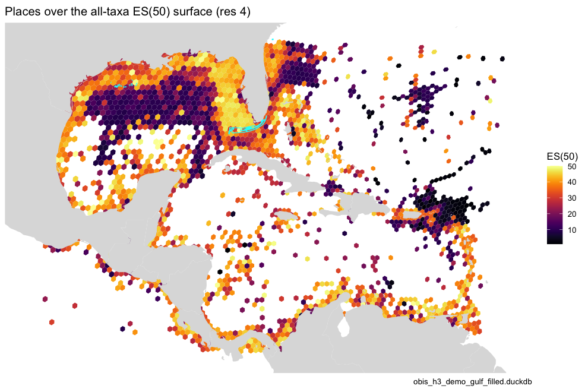

# Rolling hexagons up to places

Managers ask about places — a National Marine Sanctuary, an EEZ, a
proposed protected area — not hexagons. Because every record in the
store is already binned to fine H3 cells, a place is just a set of
cells:
[`place_cells()`](https://marinebon.org/obisindicators/reference/place_cells.md)
fills each polygon with cells at a chosen resolution, and
[`calc_place_indicators()`](https://marinebon.org/obisindicators/reference/calc_place_indicators.md)
pools the species counts of those cells and computes the indicators with
the same
[`calc_indicators()`](https://marinebon.org/obisindicators/reference/calc_indicators.md)
reference used everywhere else. This is Figure 6 of the OBIS → H3 → EOV
manuscript, and the pattern behind the
[MarineSensitivity](https://marinesensitivity.org) place summaries.

``` r

library(obisindicators)
library(dplyr)
library(ggplot2)
library(sf)

con <- obis_store_connect()   # the store named by OBIS_H3_DUCKDB
```

> **Precomputed.** The store is not available where this documentation
> is built, so the chunks below were run locally by
> `data-raw/precompute_articles.R` and their output committed. This
> render used **obis_h3_demo_gulf_filled.duckdb**, a regional demo store
> (Gulf of Mexico + Caribbean, see `paper/build_demo_store.R`).

## The places

Any `sf` polygons work. Here: a GeoPackage named by `PLACES_GPKG` if
set, otherwise the U.S. National Marine Sanctuaries from
[`onmsR`](https://noaa-onms.github.io/onmsR/), otherwise three demo
boxes. Places that do not touch the store’s footprint are dropped.

``` r

places_path <- Sys.getenv("PLACES_GPKG")
places <- if (nzchar(places_path) && file.exists(places_path)) {
  st_read(places_path, quiet = TRUE)
} else if (requireNamespace("onmsR", quietly = TRUE)) {
  onmsR::sanctuaries
} else {
  bx <- function(n, xmin, ymin, xmax, ymax) st_sf(name = n, geometry = st_as_sfc(
    st_bbox(c(xmin = xmin, ymin = ymin, xmax = xmax, ymax = ymax), crs = st_crs(4326))))
  rbind(bx("Florida Keys", -83, 24, -80, 26), bx("NW Gulf", -97, 26, -90, 30),
        bx("Lesser Antilles", -64, 12, -60, 18))
}
name_col <- intersect(c("sanctuary", "name", "NAME", "nms"), names(places))[1]
res_p    <- as.integer(Sys.getenv("PAPER_RES_PLACE", "6"))

# keep places that intersect the store's footprint (occupied cells at res 2)
foot   <- hex_sf(obis_cell_indicators(con, 2)$cell)
places <- places[lengths(st_intersects(st_transform(places, 4326), foot)) > 0, ]
places[[name_col]]
#> [1] "Flower Garden Banks" "Florida Keys"        "Gray's Reef"
```

## Indicators per place and EOV

Each place is filled with H3 res 6 cells (`n_cells`), of which
`n_cells_occupied` hold records; `n`, `sp`, `es` and the Hill numbers
are then computed on the pooled records — for all taxa and for each EOV.

``` r

pi <- bind_rows(lapply(c("all taxa", EOV_ORDER), function(e) {
  d <- calc_place_indicators(con, places, name_col, res = res_p,
                             eov = if (e == "all taxa") NULL else e, esn = 50L)
  cbind(group = e, d)
}))
knitr::kable(
  pi |> select(group, place, n_cells, n_cells_occupied, n, sp, es, hill_1) |>
    mutate(es = round(es, 2), hill_1 = round(hill_1, 2)),
  caption = sprintf("Indicators per place and EOV (fill resolution H3 %d)", res_p))
```

| group | place | n_cells | n_cells_occupied | n | sp | es | hill_1 |
|:---|:---|---:|---:|---:|---:|---:|---:|
| all taxa | Florida Keys | 303 | 294 | 1314101 | 4133 | 33.08 | 88.37 |
| all taxa | Flower Garden Banks | 8 | 8 | 6744 | 338 | 23.84 | 40.39 |
| all taxa | Gray’s Reef | 2 | 0 | NA | NA | NA | NA |
| fish | Florida Keys | 303 | 243 | 1249849 | 853 | 31.71 | 66.78 |
| fish | Flower Garden Banks | 8 | 6 | 282 | 62 | 25.64 | 32.99 |
| fish | Gray’s Reef | 2 | 0 | NA | NA | NA | NA |
| hardCorals | Florida Keys | 303 | 130 | 23162 | 80 | 18.72 | 19.62 |
| hardCorals | Flower Garden Banks | 8 | 7 | 4839 | 37 | 14.18 | 13.89 |
| hardCorals | Gray’s Reef | 2 | 0 | NA | NA | NA | NA |
| mangroves | Florida Keys | 303 | 0 | NA | NA | NA | NA |
| mangroves | Flower Garden Banks | 8 | 0 | NA | NA | NA | NA |
| mangroves | Gray’s Reef | 2 | 0 | NA | NA | NA | NA |
| marineMammals | Florida Keys | 303 | 51 | 776 | 5 | 2.37 | 2.07 |
| marineMammals | Flower Garden Banks | 8 | 1 | 1 | 1 | NA | 1.00 |
| marineMammals | Gray’s Reef | 2 | 0 | NA | NA | NA | NA |
| seabirds | Florida Keys | 303 | 33 | 48 | 9 | NA | 4.34 |
| seabirds | Flower Garden Banks | 8 | 1 | 1 | 1 | NA | 1.00 |
| seabirds | Gray’s Reef | 2 | 0 | NA | NA | NA | NA |
| seagrasses | Florida Keys | 303 | 7 | 405 | 4 | 3.11 | 2.37 |
| seagrasses | Flower Garden Banks | 8 | 0 | NA | NA | NA | NA |
| seagrasses | Gray’s Reef | 2 | 0 | NA | NA | NA | NA |
| seaTurtles | Florida Keys | 303 | 71 | 164 | 5 | 4.31 | 2.56 |
| seaTurtles | Flower Garden Banks | 8 | 0 | NA | NA | NA | NA |
| seaTurtles | Gray’s Reef | 2 | 0 | NA | NA | NA | NA |

Indicators per place and EOV (fill resolution H3 6) {.table}

``` r

d <- pi |> filter(!is.na(n)) |>
  mutate(reliable = n >= 50, place = reorder(place, -n))
p <- ggplot(d, aes(x = place, y = es, fill = group, alpha = reliable)) +
  geom_col(position = position_dodge(width = .85), width = .8) +
  scale_alpha_manual(values = c(`TRUE` = 1, `FALSE` = .35), guide = "none") +
  labs(x = NULL, y = "ES(50)", fill = NULL,
       title = "ES(50) per place and EOV (faded = fewer than 50 records)",
       caption = store_label) +
  theme_minimal(base_size = 11) +
  theme(legend.position = "bottom", axis.text.x = element_text(angle = 30, hjust = 1))
p
```


plot of chunk fig6

## Where the places sit

The places over the all-taxa ES(50) surface (H3 4, masked to cells with
at least 50 records):

``` r

allr  <- obis_cell_indicators(con, RES_MAP)
robin <- "+proj=robin +lon_0=0 +x_0=0 +y_0=0 +ellps=WGS84 +datum=WGS84 +units=m +no_defs"
bb    <- st_bbox(st_transform(hex_sf(allr$cell), robin))
p <- gmap_cells(allr, "es", label = "ES(50)", mask = allr$n >= 50) +
  geom_sf(data = st_transform(places, 4326), fill = NA, color = "cyan", linewidth = .4) +
  # re-assert the frame: an added sf layer otherwise widens coord_sf to the world
  coord_sf(crs = robin, xlim = bb[c("xmin", "xmax")], ylim = bb[c("ymin", "ymax")]) +
  labs(title = sprintf("Places over the all-taxa ES(50) surface (res %d)", RES_MAP), caption = store_label)
p
```



plot of chunk fig6-map

``` r

DBI::dbDisconnect(con, shutdown = TRUE)
```
