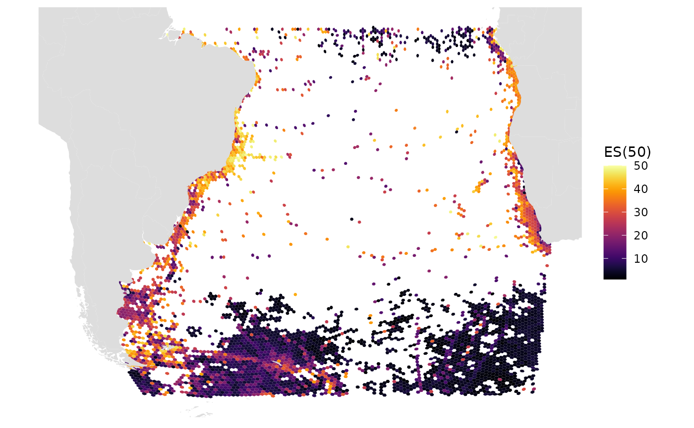
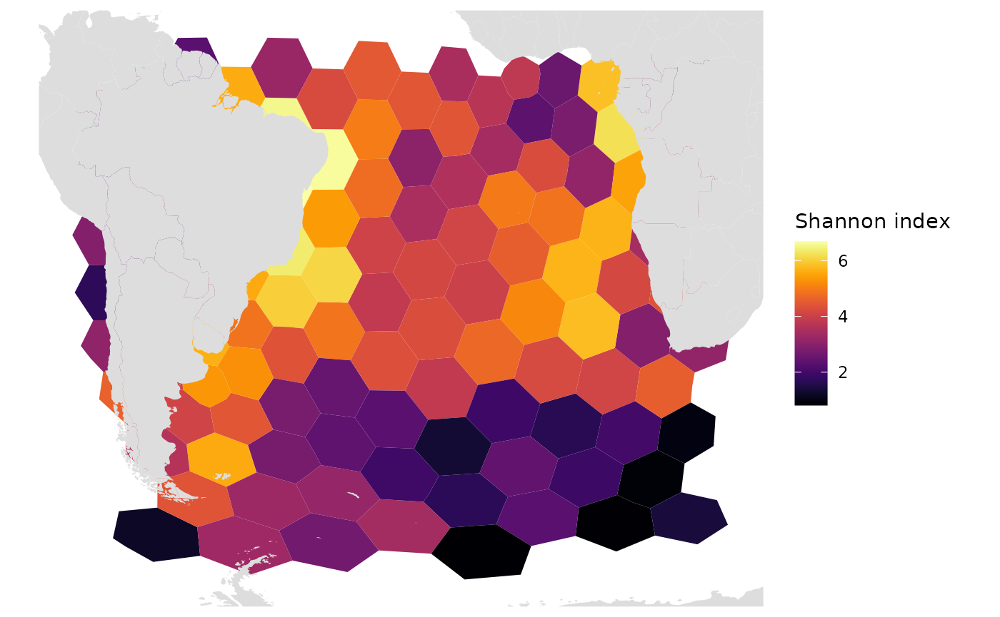
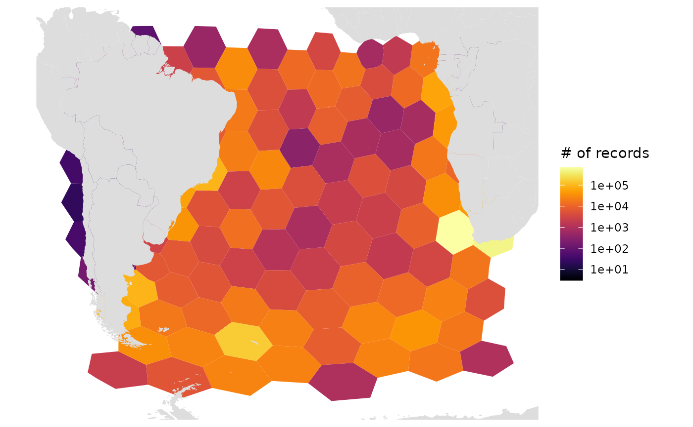
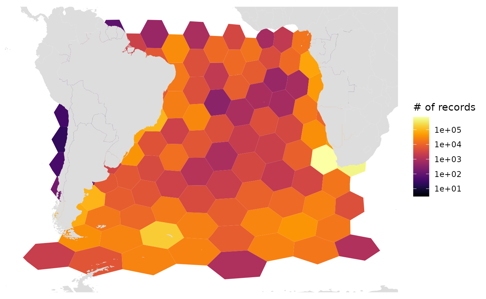

# Regional Diversity

``` r

library(obisindicators)
library(dplyr)
library(sf)
```

## Get regional biological occurrences

Let’s use the regional subset for the South Atlantic from the full OBIS
dataset otherwise available at <https://obis.org/data/access>.

``` r

occ <- occ_SAtlantic # occ_1M OR occ_SAtlantic
```

## Create a global h3 hexagonal grid

``` r

hex_res <- 1  # hex_res 0 is too big to work, all others work
hex <- obisindicators::make_hex_res(hex_res)
# mapview::mapview(hex)  # you can view the hex grid with h3 IDs 

# === Then assign cell numbers to the occurrence data:
occ <- occ %>% 
  mutate(
    cell = h3::geo_to_h3(
      data.frame(decimalLatitude, decimalLongitude),
      res = hex_res))
```

## Calculate indicators

The following function calculates the number of records, species
richness, Simpson index, Shannon index, Hurlbert index (n = 50), and
Hill numbers for each cell.

Perform the calculation on species level data:

``` r

idx <- calc_indicators(occ)
```

Add cell geometries to the indicators table (`idx`):

``` r

grid <- hex %>% 
  inner_join(
    idx,
    by = c("hexid" = "cell"))
# you could now visualize with:
# plot(grid["es"])
# mapview::mapview(grid["es"])
```

## Plot maps of indicators

Let’s look at the resulting indicators in map form.

``` r

# ES(50)
gmap_indicator(grid, "es", label = "ES(50)")
```



``` r


# Shannon index
gmap_indicator(grid, "shannon", label = "Shannon index")
```



``` r


# Number of records, log10 scale, Robinson projection (default)
gmap_indicator(grid, "n", label = "# of records", trans = "log10")
```



``` r


# Number of records, log10 scale, Geographic projection
gmap_indicator(grid, "n", label = "# of records", trans = "log10", crs=4326)
```


