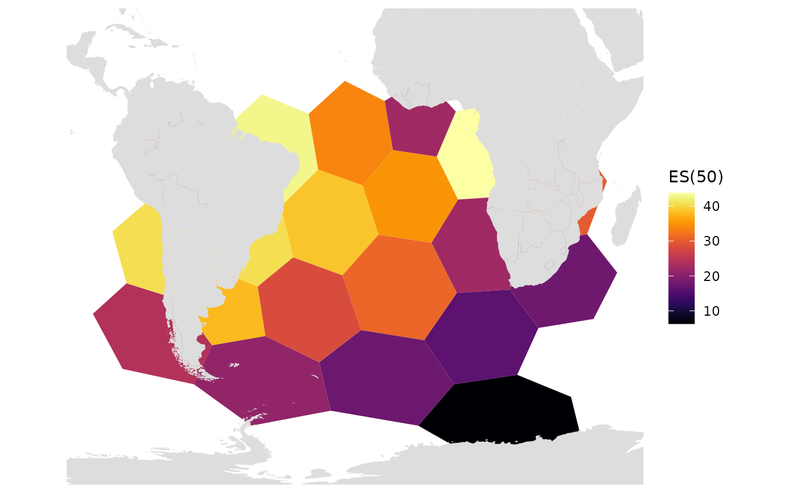
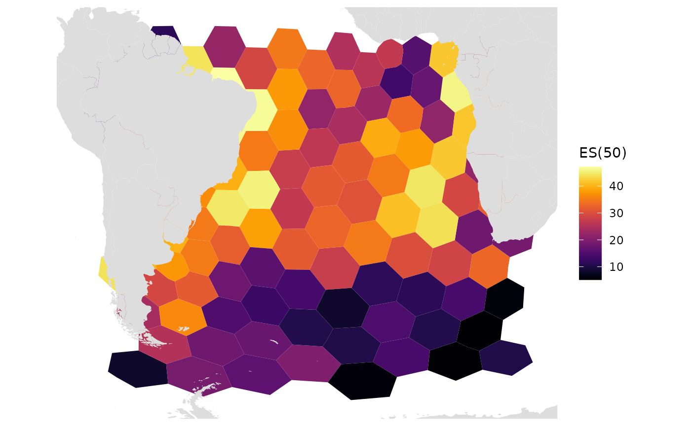
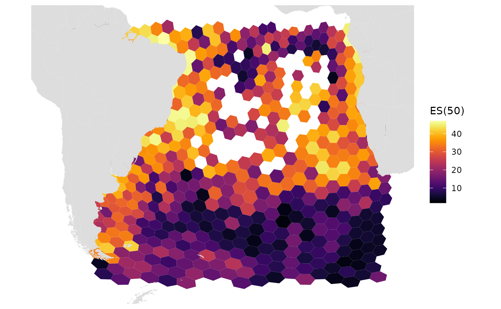
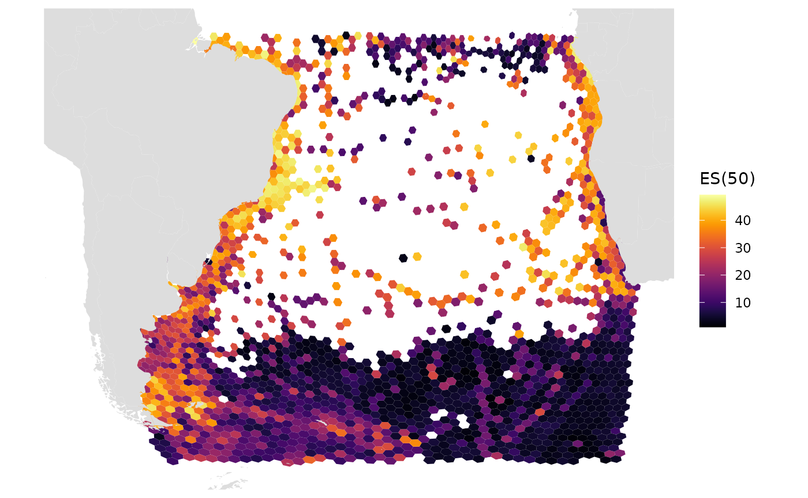

# resolution

``` r

library(obisindicators)
#> Warning: replacing previous import 'h3::compact' by 'purrr::compact' when
#> loading 'obisindicators'
library(dplyr)
#> 
#> Attaching package: 'dplyr'
#> The following objects are masked from 'package:stats':
#> 
#>     filter, lag
#> The following objects are masked from 'package:base':
#> 
#>     intersect, setdiff, setequal, union
library(sf)
#> Linking to GEOS 3.12.1, GDAL 3.8.4, PROJ 9.4.0; sf_use_s2() is TRUE
```

## Get biological occurrences

``` r

occ <- occ_SAtlantic # occ_1M OR occ_SAtlantic
```

## Create function to make grid, calculate metrics, and plot maps for different resolution grid sizes

``` r

res_changes <- function(resolution = 2){
  hex_res <- 1  # hex_res 0 is too big to work, all others work
  hex <- obisindicators::make_hex_res(resolution)

  # === Then assign cell numbers to the occurrence data:
  occ <- occ %>% 
    mutate(
      cell = h3::geo_to_h3(
        data.frame(decimalLatitude, decimalLongitude),
        res = resolution))
  idx <- calc_indicators(occ)

  grid <- hex %>% 
    inner_join(
      idx,
      by = c("hexid" = "cell"))

  gmap_indicator(grid, "es", label = "ES(50)")
}
```

## Different Resolutions

Details of H3 resolution differences can be found in the [h3geo
docs](https://h3geo.org/docs/core-library/restable/). Resolutions range
from 0 (largest) to 15 (smallest).

Generally, resolution 0 is too big to be useful… or even functional,
sometimes.

``` r

res_changes(0)
#> Warning: `aes_string()` was deprecated in ggplot2 3.0.0.
#> ℹ Please use tidy evaluation idioms with `aes()`.
#> ℹ See also `vignette("ggplot2-in-packages")` for more information.
#> ℹ The deprecated feature was likely used in the obisindicators package.
#>   Please report the issue at
#>   <https://github.com/marinebon/obisindicators/issues>.
#> This warning is displayed once per session.
#> Call `lifecycle::last_lifecycle_warnings()` to see where this warning was
#> generated.
```



``` r

res_changes(1)
```



At this resolution the S Atlantic is completely covered, meaning that
every hex had enough data to compute the ES(50) diversity metric. We can
see some basic expected patterns such as: \* higher diversity near to
the coast \* higher diversity near the equator

``` r

res_changes(2)
```



A this resolution we see gaps throughout the central South Atlantic.
These hexagons did not have enough occurrence records to calculate the
diversity metric.

``` r

res_changes(3)
```

 At this higher
resolution, gaps dominate the map. Only places with relatively dense
surveying efforts have enough data to calculate the diversity metric.
Note how the relatively data-poor center has a relatively stark boundary
spanning from the southern tip of Africa across. This boundary is
visible in the diversity metric plots of lower resolution in the form of
a high-low diversity boundary. The appearance of this abrupt high-low
diversity boundary is likely an artifact of how data-poor the central
South Atlantic is. The ES50 diversity metric will bias data-poor to
more-diverse when there is extremely low amounts of data. It should be
noted, however, that this bias is *much* less intense than the data-poor
to less-diverse in other diversity metrics.
