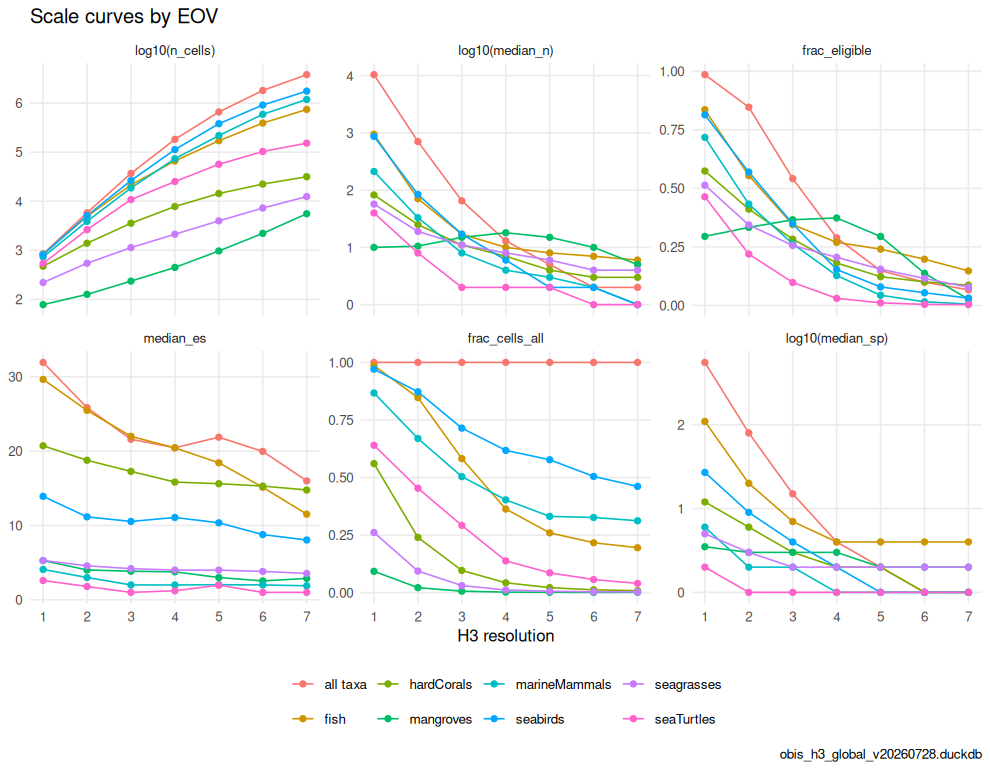
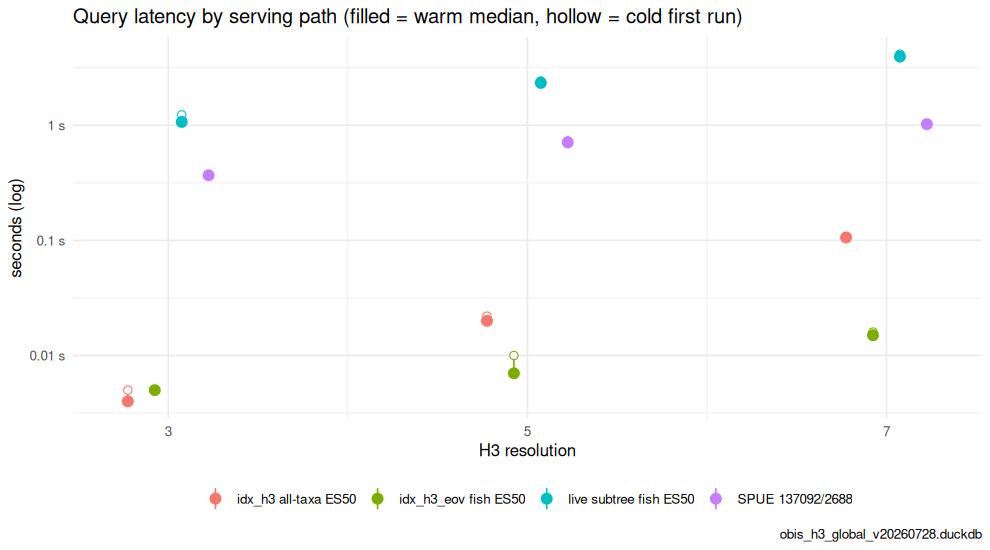
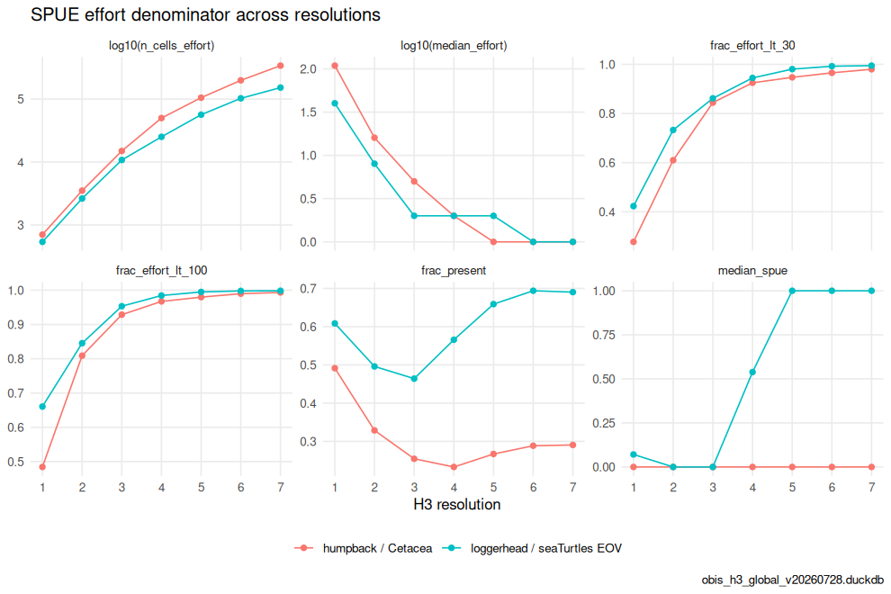

# Scaling OBIS observations across H3 resolutions

H3 is a hierarchy: each drop in resolution aggregates ~7 child hexagons
into a parent. Summarizing OBIS with the same query at different H3
resolutions therefore trades **spatial detail** against **per-cell
sample size** and **query cost**. This article walks those trade-offs
and the choices they force in the `h3t` serving design — especially for
the live children-taxa and SPUE paths from
[`vignette("taxon_children")`](https://marinebon.org/obisindicators/articles/taxon_children.md).
It also produces Tables 2, 3 and 5 and Figure 3 of the OBIS → H3 → EOV
manuscript.

``` r

library(obisindicators)
library(dplyr)
library(ggplot2)

# the store named by OBIS_H3_DUCKDB; paper/build_demo_store.R builds a regional demo
con <- obis_store_connect()
```

> **Precomputed.** The store is not available where this documentation
> is built, so the chunks below were run locally by
> `data-raw/precompute_articles.R` and their output committed. This
> render used **obis_h3_global_v20260728.duckdb**, the global store. The
> manuscript’s numbers come from the global store.

## What the store holds (Table 2)

[`obis_store_stats()`](https://marinebon.org/obisindicators/reference/obis_store_stats.md)
summarizes the layers of a store: the species-level `occ_h3` counts at
resolution tiers 3/5/7, the precomputed all-taxa `idx_h3`,
per-coarse-rank `idx_h3_taxon` and per-EOV `idx_h3_eov` indicator layers
(resolutions 1–7), and the WoRMS `taxon` table that makes any-rank
filters possible.

``` r

s <- obis_store_stats(con)
knitr::kable(s$totals, caption = "Totals")
```

| metric        | value     |
|:--------------|:----------|
| records       | 127329658 |
| species       | 164336    |
| aphiaids      | 167416    |
| cells_base    | 3792953   |
| year_min      | 1103      |
| year_max      | 2026      |
| taxon_rows    | 1571870   |
| eov_members   | 135388    |
| database_size | 4.0 GiB   |

Totals {.table}

``` r

knitr::kable(s$tables, caption = "Tables and row counts")
```

| table        |     rows |
|:-------------|---------:|
| eov          |   135388 |
| idx_h3       |  6481134 |
| idx_h3_eov   |  7138315 |
| idx_h3_taxon | 44216189 |
| occ_h3       | 58889539 |
| taxon        |  1571870 |

Tables and row counts {.table}

``` r

knitr::kable(
  s$cells_by_res |> mutate(area_km2 = round(area_km2), edge_km = round(edge_km, 1)),
  caption = "Occupied cells by H3 resolution")
```

| res | n_cells |   records | area_km2 | edge_km |
|----:|--------:|----------:|---------:|--------:|
|   1 |     842 | 127329658 |   609788 |   483.1 |
|   2 |    5799 | 127329658 |    86802 |   182.5 |
|   3 |   36893 | 127329658 |    12393 |    69.0 |
|   4 |  182038 | 127329658 |     1770 |    26.1 |
|   5 |  657311 | 127329658 |      253 |     9.9 |
|   6 | 1805298 | 127329658 |       36 |     3.7 |
|   7 | 3792953 | 127329658 |        5 |     1.4 |

Occupied cells by H3 resolution {.table}

## Cells vs. density across resolution (Fig. 3a)

Take one taxon — all Cetacea (AphiaID 2688, an infraorder, so not a
Darwin Core rank column; see
[`vignette("taxon_children")`](https://marinebon.org/obisindicators/articles/taxon_children.md))
— and summarize it at every stored resolution. As resolution rises, the
cell count climbs roughly ×7 per step while the median records-per-cell
falls: the signal spreads thinner, and the fraction of cells that can
support ES(50) (at least 50 records) collapses.

``` r

calc_scale_curves(con, res = 1:7, aphiaid = 2688L, group = "Cetacea") |>
  select(res, n_cells, median_n, frac_eligible, median_es) |>
  mutate(frac_eligible = round(frac_eligible, 3), median_es = round(median_es, 2))
#>   res n_cells median_n frac_eligible median_es
#> 1   1     702      109         0.623      5.00
#> 2   2    3507       16         0.286      5.24
#> 3   3   14973        5         0.111      5.23
#> 4   4   49968        2         0.053      4.56
#> 5   5  105334        1         0.035      3.96
#> 6   6  198771        1         0.021      3.12
#> 7   7  340290        1         0.012      2.41
```

[`calc_scale_curves()`](https://marinebon.org/obisindicators/reference/calc_scale_curves.md)
does the same for any filter. Here it is for all taxa and for each of
the seven Essential Ocean Variables (EOVs; see
[`vignette("eov")`](https://marinebon.org/obisindicators/articles/eov.md)):

``` r

RES <- 1:7
sc <- bind_rows(
  calc_scale_curves(con, res = RES, group = "all taxa"),
  bind_rows(lapply(EOV_ORDER, function(e)
    calc_scale_curves(con, res = RES, eov = e, group = e))))
sc |>
  select(group, res, n_cells, frac_cells_all, median_n, frac_eligible, median_es, median_sp) |>
  mutate(across(c(frac_cells_all, frac_eligible), ~ round(.x, 3)), median_es = round(median_es, 2))
#>            group res n_cells frac_cells_all median_n frac_eligible median_es
#> 1       all taxa   1     842          1.000  10427.5         0.986     31.93
#> 2       all taxa   2    5799          1.000    707.0         0.847     25.84
#> 3       all taxa   3   36893          1.000     65.0         0.542     21.59
#> 4       all taxa   4  182038          1.000     13.0         0.289     20.45
#> 5       all taxa   5  657311          1.000      5.0         0.149     21.87
#> 6       all taxa   6 1805298          1.000      2.0         0.099     19.96
#> 7       all taxa   7 3792953          1.000      2.0         0.066     16.00
#> 8           fish   1     830          0.986    947.0         0.836     29.64
#> 9           fish   2    4912          0.847     71.0         0.555     25.47
#> 10          fish   3   21481          0.582     17.0         0.345     21.99
#> 11          fish   4   66094          0.363     10.0         0.269     20.43
#> 12          fish   5  170687          0.260      8.0         0.240     18.43
#> 13          fish   6  391413          0.217      7.0         0.197     15.13
#> 14          fish   7  740349          0.195      6.0         0.147     11.52
#> 15    hardCorals   1     472          0.561     82.5         0.574     20.72
#> 16    hardCorals   2    1391          0.240     25.0         0.411     18.76
#> 17    hardCorals   3    3556          0.096     11.0         0.283     17.27
#> 18    hardCorals   4    7793          0.043      7.0         0.181     15.83
#> 19    hardCorals   5   14349          0.022      4.0         0.123     15.62
#> 20    hardCorals   6   22318          0.012      3.0         0.101     15.29
#> 21    hardCorals   7   31520          0.008      3.0         0.086     14.77
#> 22     mangroves   1      78          0.093     10.0         0.295      5.27
#> 23     mangroves   2     126          0.022     10.5         0.333      4.01
#> 24     mangroves   3     235          0.006     15.0         0.366      3.84
#> 25     mangroves   4     447          0.002     18.0         0.374      3.76
#> 26     mangroves   5     968          0.001     15.0         0.294      3.00
#> 27     mangroves   6    2208          0.001     10.0         0.137      2.54
#> 28     mangroves   7    5547          0.001      5.0         0.026      2.88
#> 29 marineMammals   1     730          0.867    212.0         0.718      4.08
#> 30 marineMammals   2    3884          0.670     33.0         0.433      3.00
#> 31 marineMammals   3   18589          0.504      8.0         0.263      2.00
#> 32 marineMammals   4   73360          0.403      4.0         0.127      2.00
#> 33 marineMammals   5  217692          0.331      3.0         0.043      2.03
#> 34 marineMammals   6  589527          0.327      2.0         0.015      2.00
#> 35 marineMammals   7 1183783          0.312      1.0         0.006      1.89
#> 36      seabirds   1     817          0.970    867.0         0.814     13.91
#> 37      seabirds   2    5058          0.872     84.0         0.570     11.16
#> 38      seabirds   3   26361          0.715     17.0         0.349     10.54
#> 39      seabirds   4  112475          0.618      6.0         0.153     11.07
#> 40      seabirds   5  379397          0.577      2.0         0.079     10.36
#> 41      seabirds   6  911344          0.505      2.0         0.054      8.77
#> 42      seabirds   7 1750076          0.461      1.0         0.031      8.04
#> 43    seagrasses   1     220          0.261     57.0         0.514      5.29
#> 44    seagrasses   2     544          0.094     19.0         0.344      4.57
#> 45    seagrasses   3    1133          0.031     11.0         0.256      4.19
#> 46    seagrasses   4    2122          0.012      8.0         0.205      4.00
#> 47    seagrasses   5    3975          0.006      6.0         0.155      4.00
#> 48    seagrasses   6    7261          0.004      4.0         0.115      3.81
#> 49    seagrasses   7   12420          0.003      4.0         0.078      3.55
#> 50    seaTurtles   1     539          0.640     40.0         0.464      2.60
#> 51    seaTurtles   2    2631          0.454      8.0         0.219      1.79
#> 52    seaTurtles   3   10772          0.292      2.0         0.098      1.00
#> 53    seaTurtles   4   25130          0.138      2.0         0.030      1.21
#> 54    seaTurtles   5   56528          0.086      2.0         0.011      1.97
#> 55    seaTurtles   6  102901          0.057      1.0         0.004      1.00
#> 56    seaTurtles   7  152272          0.040      1.0         0.003      1.00
#>    median_sp
#> 1      554.5
#> 2       80.0
#> 3       15.0
#> 4        4.0
#> 5        2.0
#> 6        1.0
#> 7        1.0
#> 8      109.5
#> 9       20.0
#> 10       7.0
#> 11       4.0
#> 12       4.0
#> 13       4.0
#> 14       4.0
#> 15      12.0
#> 16       6.0
#> 17       3.0
#> 18       2.0
#> 19       2.0
#> 20       1.0
#> 21       1.0
#> 22       3.5
#> 23       3.0
#> 24       3.0
#> 25       3.0
#> 26       2.0
#> 27       2.0
#> 28       2.0
#> 29       6.0
#> 30       2.0
#> 31       2.0
#> 32       1.0
#> 33       1.0
#> 34       1.0
#> 35       1.0
#> 36      27.0
#> 37       9.0
#> 38       4.0
#> 39       2.0
#> 40       1.0
#> 41       1.0
#> 42       1.0
#> 43       5.0
#> 44       3.0
#> 45       2.0
#> 46       2.0
#> 47       2.0
#> 48       2.0
#> 49       2.0
#> 50       2.0
#> 51       1.0
#> 52       1.0
#> 53       1.0
#> 54       1.0
#> 55       1.0
#> 56       1.0
```

``` r

p <- plot_scale_curves(
  sc,
  metrics = c("n_cells", "median_n", "frac_eligible", "median_es", "frac_cells_all", "median_sp"),
  log_y   = c("n_cells", "median_n", "median_sp")) +
  labs(title = "Scale curves by EOV", caption = store_label)
p
```



plot of chunk fig3a

The store keeps species-level `occ_h3` at only three tiers (3 / 5 / 7);
a query at res 1–2 rolls up from tier 3, res 4 from tier 5, res 6 from
tier 7 (see
[`obis_h3t_sql()`](https://marinebon.org/obisindicators/reference/obis_h3t_sql.md)).
Rolling *up* is cheap; the expense is the base-tier scan.

## Precomputed vs. live query cost (Table 5)

Unfiltered and coarse-rank (phylum/class/order) indicators are
**precomputed** into `idx_h3` / `idx_h3_taxon` (one row per cell, res
1–7), and each EOV into `idx_h3_eov` — all served with a plain indexed
lookup at any resolution. The children-taxa (`aphiaid=`) and SPUE paths
have no precomputed layer: they aggregate `occ_h3` **live**, resolving
the WoRMS subtree with a recursive CTE on each request.

[`obis_bench_queries()`](https://marinebon.org/obisindicators/reference/obis_bench_queries.md)
builds the four paths a tile can take — precomputed all-taxa,
precomputed EOV, live EOV subtree over `occ_h3`, and the SPUE effort
proxy (two recursive subtrees) — and
[`obis_bench()`](https://marinebon.org/obisindicators/reference/obis_bench.md)
times them. Cold = first run; warm = median of 3 repeats, which is what
the Varnish-fronted service sees after the first viewer.

``` r

q <- obis_bench_queries(res = c(3L, 5L, 7L), eov = "fish",
                        num_aphiaid = 137092L, den_aphiaid = 2688L)  # humpback / Cetacea
b <- obis_bench(con, q, reps = 3L) |>
  mutate(path = sub(" res \\d$", "", label),
         res  = as.integer(sub(".* res (\\d)$", "\\1", label)))
knitr::kable(
  b |> select(path, res, rows, cold_s, warm_s) |> mutate(across(c(cold_s, warm_s), ~ round(.x, 3))),
  caption = "Query latency by serving path (seconds)")
```

| path                   | res |    rows | cold_s | warm_s |
|:-----------------------|----:|--------:|-------:|-------:|
| idx_h3 all-taxa ES50   |   3 |   36893 |  0.005 |  0.004 |
| idx_h3_eov fish ES50   |   3 |   21481 |  0.005 |  0.005 |
| live subtree fish ES50 |   3 |   21481 |  1.234 |  1.070 |
| SPUE 137092/2688       |   3 |   14973 |  0.371 |  0.368 |
| idx_h3 all-taxa ES50   |   5 |  657311 |  0.022 |  0.020 |
| idx_h3_eov fish ES50   |   5 |  170687 |  0.010 |  0.007 |
| live subtree fish ES50 |   5 |  170687 |  2.430 |  2.334 |
| SPUE 137092/2688       |   5 |  105334 |  0.730 |  0.711 |
| idx_h3 all-taxa ES50   |   7 | 3792953 |  0.107 |  0.106 |
| idx_h3_eov fish ES50   |   7 |  740349 |  0.016 |  0.015 |
| live subtree fish ES50 |   7 |  740349 |  4.155 |  3.952 |
| SPUE 137092/2688       |   7 |  340290 |  1.026 |  1.022 |

Query latency by serving path (seconds) {.table}

``` r

p <- ggplot(b, aes(x = res, y = warm_s, color = path)) +
  geom_linerange(aes(ymin = warm_s, ymax = cold_s), position = position_dodge(width = .6), linewidth = .5) +
  geom_point(aes(y = cold_s), position = position_dodge(width = .6), shape = 21, fill = "white", size = 2.2) +
  geom_point(position = position_dodge(width = .6), size = 3) +
  scale_x_continuous(breaks = unique(b$res)) +
  scale_y_log10(labels = function(x) paste0(x, " s")) +
  labs(x = "H3 resolution", y = "seconds (log)", color = NULL,
       title = "Query latency by serving path (filled = warm median, hollow = cold first run)",
       caption = store_label) +
  theme_minimal(base_size = 11) + theme(legend.position = "bottom")
p
```



plot of chunk tab5

Live cost grows with (a) the breadth of the subtree (a class resolves
tens of thousands of descendants) and (b) the base-tier row count at
fine resolution. The server caps a single statement at
`H3T_STMT_TIMEOUT_MS` (8 s); a broad taxon at res 7 on the global store
can approach it.

## The SPUE denominator gets sparse (Fig. 3b)

The effort proxy divides by the *denominator* (effort-taxon records per
cell). That denominator thins with resolution faster than intuition
suggests: a ratio of 1/1 and 30/60 both render, but only the latter is
trustworthy.
[`calc_spue_scale()`](https://marinebon.org/obisindicators/reference/calc_spue_scale.md)
tracks the number of effort cells, the median effort, and the fraction
of cells whose effort falls below a reliability floor, across
resolutions. Two case studies: humpback whale over all Cetacea
(multi-species cetacean surveys), and loggerhead turtle over the
sea-turtles EOV.

``` r

cases <- tribble(
  ~group,                         ~num,     ~den,
  "humpback / Cetacea",           137092L,  2688L,
  "loggerhead / seaTurtles EOV",  137205L,  obis_eov_aphiaid("seaTurtles"))
ss <- bind_rows(lapply(seq_len(nrow(cases)), function(i)
  calc_spue_scale(con, cases$num[[i]], cases$den[[i]], res = RES, group = cases$group[i])))
ss |> mutate(across(starts_with("frac_"), ~ round(.x, 3)), median_spue = round(median_spue, 3))
#>                          group res   area_km2 n_cells_effort effort_records
#> 1           humpback / Cetacea   1 609788.442            702        2241724
#> 2           humpback / Cetacea   2  86801.780           3507        2241724
#> 3           humpback / Cetacea   3  12393.435          14973        2241724
#> 4           humpback / Cetacea   4   1770.348          49968        2241724
#> 5           humpback / Cetacea   5    252.904         105334        2241724
#> 6           humpback / Cetacea   6     36.129         198771        2241724
#> 7           humpback / Cetacea   7      5.161         340290        2241724
#> 8  loggerhead / seaTurtles EOV   1 609788.442            539         447633
#> 9  loggerhead / seaTurtles EOV   2  86801.780           2631         447633
#> 10 loggerhead / seaTurtles EOV   3  12393.435          10772         447633
#> 11 loggerhead / seaTurtles EOV   4   1770.348          25130         447633
#> 12 loggerhead / seaTurtles EOV   5    252.904          56528         447633
#> 13 loggerhead / seaTurtles EOV   6     36.129         102901         447633
#> 14 loggerhead / seaTurtles EOV   7      5.161         152272         447633
#>    median_effort frac_present median_spue frac_effort_lt_10 frac_effort_lt_30
#> 1            109        0.491       0.000             0.168             0.278
#> 2             16        0.329       0.000             0.396             0.610
#> 3              5        0.254       0.000             0.692             0.844
#> 4              2        0.233       0.000             0.842             0.925
#> 5              1        0.267       0.000             0.875             0.947
#> 6              1        0.289       0.000             0.908             0.965
#> 7              1        0.291       0.000             0.937             0.980
#> 8             40        0.609       0.071             0.234             0.423
#> 9              8        0.496       0.000             0.555             0.733
#> 10             2        0.464       0.000             0.744             0.862
#> 11             2        0.566       0.538             0.792             0.945
#> 12             2        0.659       1.000             0.924             0.980
#> 13             1        0.694       1.000             0.968             0.992
#> 14             1        0.690       1.000             0.983             0.995
#>    frac_effort_lt_100
#> 1               0.484
#> 2               0.809
#> 3               0.929
#> 4               0.967
#> 5               0.980
#> 6               0.990
#> 7               0.993
#> 8               0.660
#> 9               0.845
#> 10              0.953
#> 11              0.984
#> 12              0.995
#> 13              0.998
#> 14              0.998
```

``` r

p <- plot_scale_curves(
  ss,
  metrics = c("n_cells_effort", "median_effort", "frac_effort_lt_30",
              "frac_effort_lt_100", "frac_present", "median_spue"),
  log_y   = c("n_cells_effort", "median_effort")) +
  labs(title = "SPUE effort denominator across resolutions", caption = store_label)
p
```



plot of chunk fig3b

## Design guidance

- **Prefer a precomputed layer** where the filter is knowable ahead of
  time. All-taxa, phylum/class/order and EOV maps hit `idx_h3` /
  `idx_h3_taxon` / `idx_h3_eov` and are resolution-independent in cost.
  If another children-taxa filter is used heavily, precompute it the
  same way
  ([`obis_eov_bake()`](https://marinebon.org/obisindicators/reference/obis_eov_bake.md)
  is the template).
- **Cap `res_max`** for live paths. Serving a broad subtree at res 7 is
  the worst case; `obis_h3t_sql(res_max = 5)` keeps hexagons coarser
  (and the scan cheaper) at high zoom.
- **Consider a descendant-closure table**
  (`ancestor_aphiaid → descendant_aphiaid`) baked beside `taxon`,
  turning the per-request recursive walk into a join — the natural next
  step if live children maps become hot.
- **Read SPUE with its `n`.** Style the map by `value` but gate trust on
  the effort `n`; at fine resolution most cells are low-effort.
  Aggregating to a coarser resolution (or a larger effort taxon)
  restores a usable denominator.

``` r

DBI::dbDisconnect(con, shutdown = TRUE)
```
