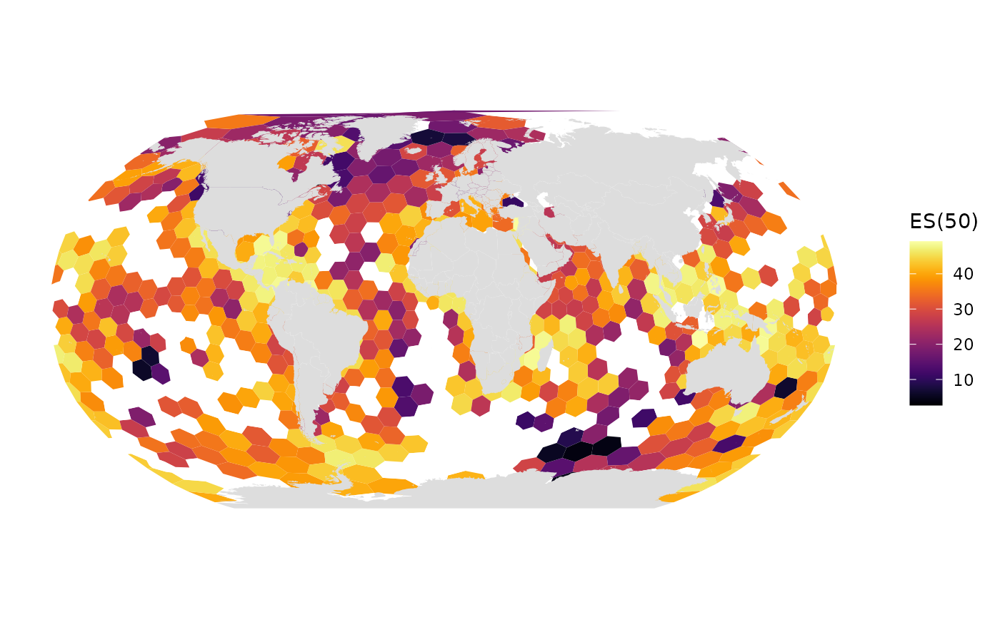
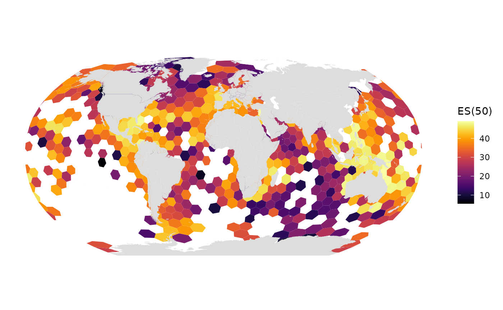
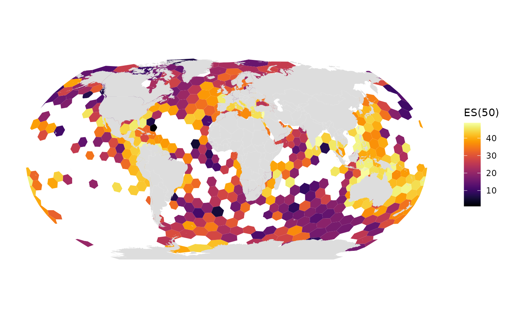
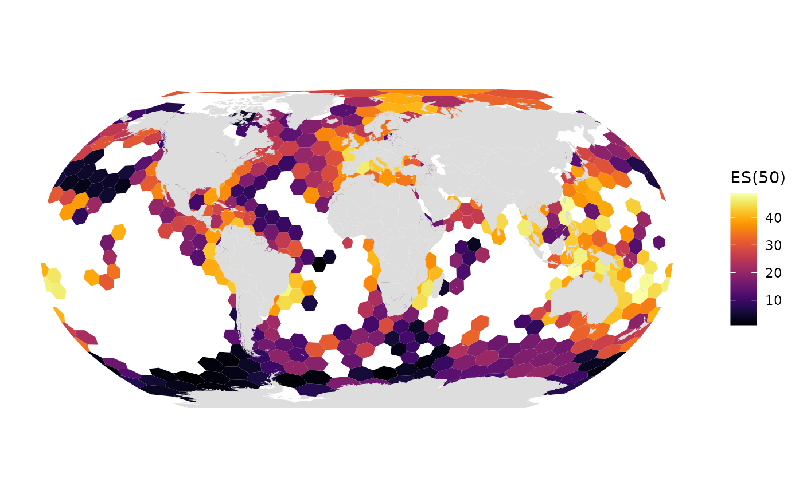
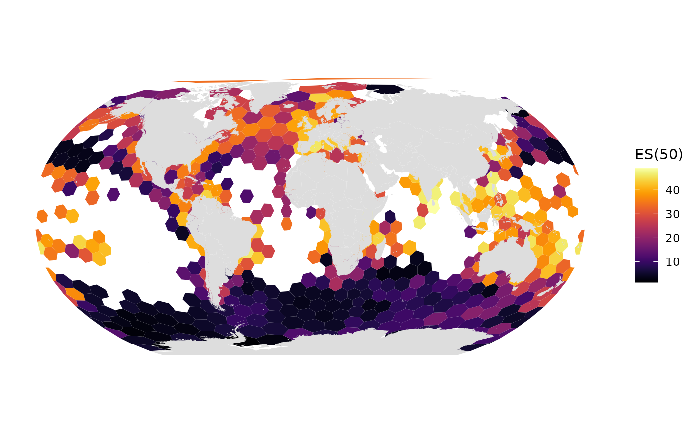
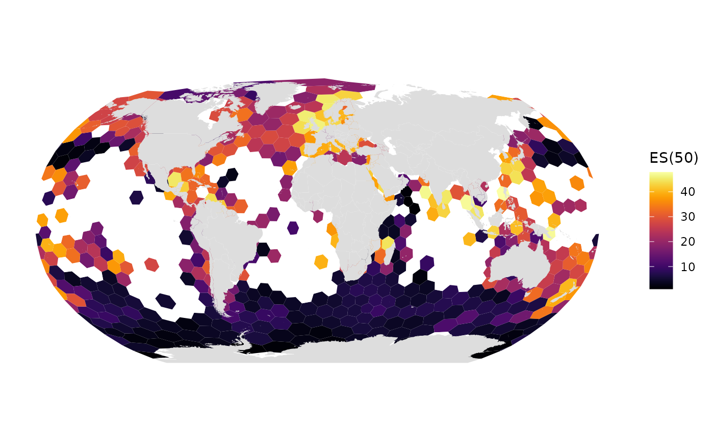

# Temporal Subsets

``` r

library(obisindicators)
#> Warning: replacing previous import 'h3::compact' by 'purrr::compact' when
#> loading 'obisindicators'
library(dplyr)
#> 
#> Attaching package: 'dplyr'
#> The following objects are masked from 'package:stats':
#> 
#>     filter, lag
#> The following objects are masked from 'package:base':
#> 
#>     intersect, setdiff, setequal, union
library(sf)
#> Linking to GEOS 3.12.1, GDAL 3.8.4, PROJ 9.4.0; sf_use_s2() is TRUE

plot_the_hex_grid <- function(occ_df){
  hex_res <- 1  # hex_res 0 is too big to work, all others work
  hex <- obisindicators::make_hex_res(hex_res)
  # mapview::mapview(hex)  # you can view the hex grid with h3 IDs 
  
  # === Then assign cell numbers to the occurrence data:
  occ_df <- occ_df %>% 
    mutate(
      cell = h3::geo_to_h3(
        data.frame(decimalLatitude, decimalLongitude),
        res = hex_res))  # calc indicators
  idx <- calc_indicators(occ_df)
  # Add cell geometries to the indicators table:
  grid <- hex %>% 
    inner_join(
      idx,
      by = c("hexid" = "cell"))

  # Plot map
  gmap_indicator(grid, "es", label = "ES(50)")
}
```

``` r

plot_the_hex_grid(occ_1960s)
#> Warning: `aes_string()` was deprecated in ggplot2 3.0.0.
#> ℹ Please use tidy evaluation idioms with `aes()`.
#> ℹ See also `vignette("ggplot2-in-packages")` for more information.
#> ℹ The deprecated feature was likely used in the obisindicators package.
#>   Please report the issue at
#>   <https://github.com/marinebon/obisindicators/issues>.
#> This warning is displayed once per session.
#> Call `lifecycle::last_lifecycle_warnings()` to see where this warning was
#> generated.
```



``` r

plot_the_hex_grid(occ_1970s)
```



``` r

plot_the_hex_grid(occ_1980s)
```



``` r

plot_the_hex_grid(occ_1990s)
```



``` r

plot_the_hex_grid(occ_2000s)
```



``` r

plot_the_hex_grid(occ_2010s)
```


