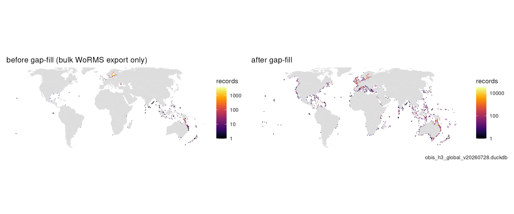
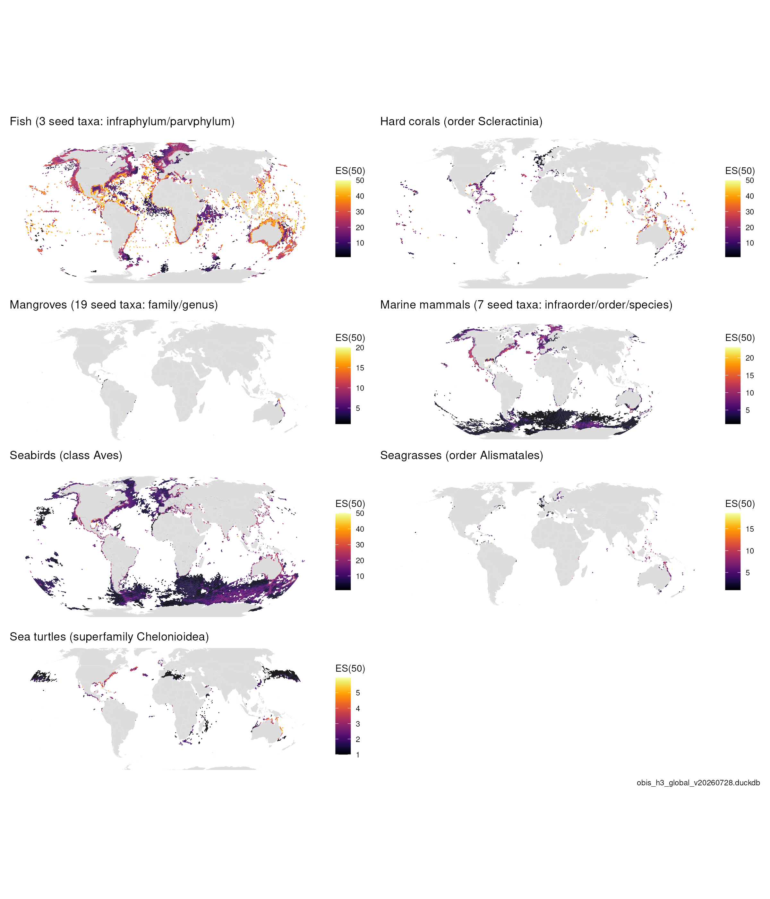
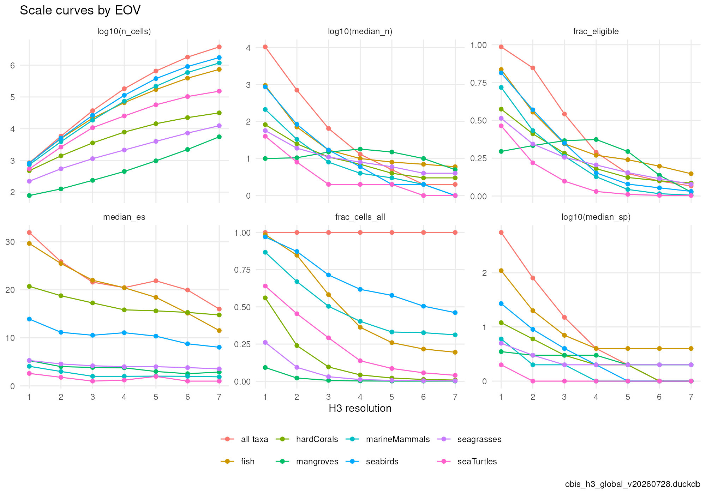
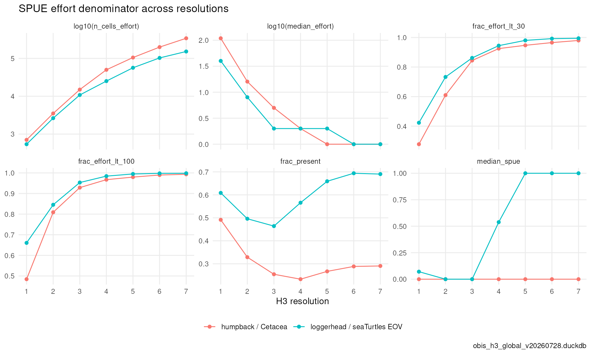
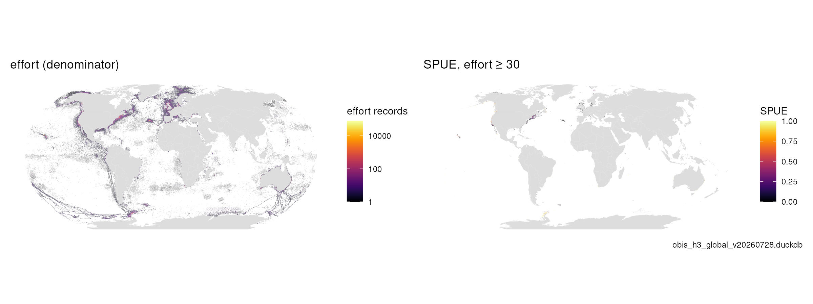
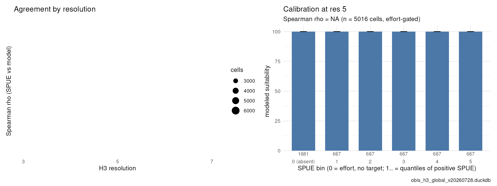
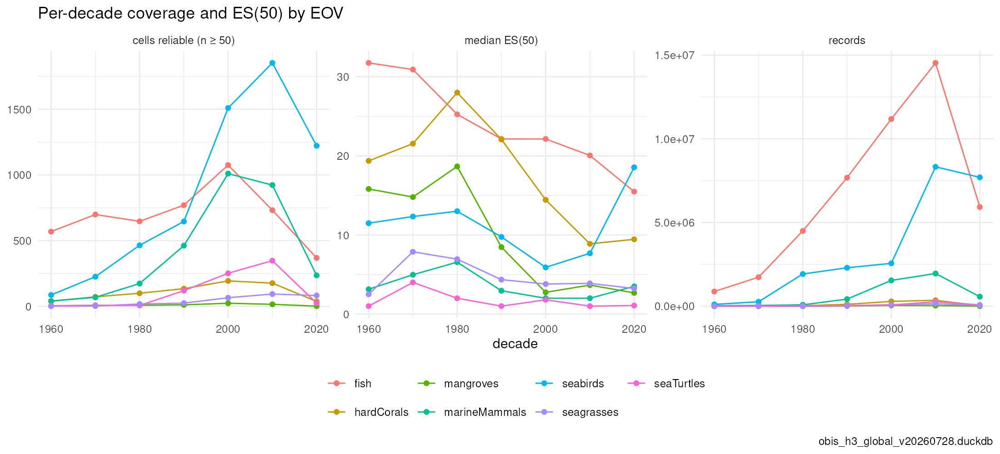
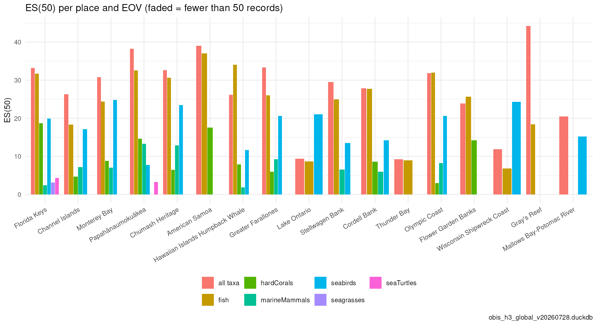
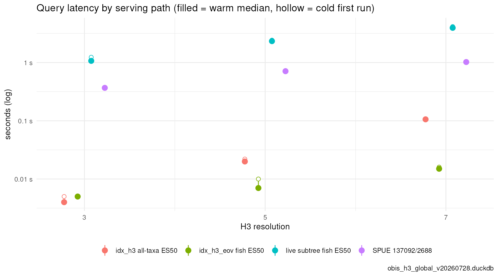

# paper/ — figures and tables for the OBIS → H3 → EOV manuscript

Every figure and table of the manuscript is produced by one of the
**precomputed articles** in `vignettes/articles/` — the same pages published at
[marinebon.org/obisindicators/articles](https://marinebon.org/obisindicators/articles/)
— by calling exported, tested functions of `obisindicators` (no analysis logic
lives in the notebooks). Manuscript copies land here in `figures/` as a
print-resolution PNG plus the CSV behind each plot, so any figure can be
regenerated from its data (per-cell tables over 20k rows are written as
`.csv.gz`; `read.csv()` reads them directly).

| manuscript item | article (rendered · [source](../vignettes/articles)) | functions | output |
|---|---|---|---|
| Table 2 (store), Table 5 (latency) | [`scaling`](https://marinebon.org/obisindicators/articles/scaling.html) · [src](../vignettes/articles/scaling.Rmd.orig) | `obis_store_stats()`, `obis_bench()`, `obis_bench_queries()` | `tab2_*.csv`, `tab5_bench.{png,csv}` |
| Fig. 3 (scale curves, SPUE denominator) | [`scaling`](https://marinebon.org/obisindicators/articles/scaling.html) | `calc_scale_curves()`, `calc_spue_scale()`, `plot_scale_curves()` | `fig3a_scale_curves`, `fig3b_spue_scale` |
| Table 3 (rank column vs subtree) | [`taxon_children`](https://marinebon.org/obisindicators/articles/taxon_children.html) · [src](../vignettes/articles/taxon_children.Rmd.orig) | `calc_rank_vs_subtree()`, `obis_rank_presets()` | `tab3_rank_vs_subtree` |
| Fig. 4 (SPUE maps; SPUE vs SDM) | [`taxon_children`](https://marinebon.org/obisindicators/articles/taxon_children.html) | `calc_spue_cells()`, `h3_raster_to_cells()`, `compare_spue_sdm()`, `plot_spue_sdm()` | `fig4a_spue_maps`, `fig4b_spue_vs_sdm`, `fig4c_spue_sdm_maps`, `fig4_spue_sdm_stats.csv` |
| Table 4 + Fig. 1 (EOV totals; gap-fill, seagrasses) | [`eov`](https://marinebon.org/obisindicators/articles/eov.html) · [src](../vignettes/articles/eov.Rmd.orig) | `calc_eov_totals()`, `compare_eov_totals()`, `obis_taxon_orphans()` | `tab4_eov_totals*.csv`, `fig1_seagrass_before_after` |
| Fig. 2 (seven EOVs: records, ES50, coverage) | [`eov`](https://marinebon.org/obisindicators/articles/eov.html) | `obis_cell_indicators()`, `gmap_cells()` | `fig2_<eov>.png`, `fig2_es50_all_eovs`, `fig2_eov_*.csv` |
| Fig. 5 (decadal change) | [`decadal`](https://marinebon.org/obisindicators/articles/decadal.html) · [src](../vignettes/articles/decadal.Rmd.orig) | `calc_period_indicators()`, `calc_period_change()` | `fig5a_decadal_summary`, `fig5b_change_<eov>`, `fig5_period_*.csv` |
| Fig. 6 (place roll-ups) | [`places`](https://marinebon.org/obisindicators/articles/places.html) · [src](../vignettes/articles/places.Rmd.orig) | `place_cells()`, `calc_place_indicators()` | `fig6_place_es50`, `fig6_places_map`, `fig6_place_indicators.csv` |

## Gallery

| | | |
|---|---|---|
|  Fig. 1 seagrasses before/after gap-fill |  Fig. 2 ES(50) per EOV |  Fig. 3a scale curves |
|  Fig. 3b SPUE denominator |  Fig. 4a effort and SPUE |  Fig. 4b SPUE vs SDM |
|  Fig. 5a per-decade coverage |  Fig. 6 ES(50) per place |  Table 5 latency by path |

## Regenerate

```bash
# 1. a store: the global one on the MST server, or a regional demo built from a
#    local OBIS export + WoRMS table (Gulf of Mexico + Caribbean, ~8M records;
#    --fill closes the taxonomy gap via WoRMS REST, giving the "after" store)
Rscript paper/build_demo_store.R                              # ~10 min -> ~/_big/obis_h3_demo_gulf.duckdb
Rscript paper/build_demo_store.R ~/_big/obis_h3_demo_gulf_filled.duckdb --fill

# 2. inputs
export OBIS_H3_DUCKDB=~/_big/obis_h3_demo_gulf_filled.duckdb
export OBIS_H3_DUCKDB_BEFORE=~/_big/obis_h3_demo_gulf.duckdb   # eov: before/after (optional)
export SDM_TIF=/path/to/suitability.tif                         # taxon_children: SPUE vs SDM (optional)
export PLACES_GPKG=/path/to/places.gpkg                         # places: else onmsR sanctuaries (optional)

# 3. knit the articles (all, or a subset) -> vignettes/articles/*.Rmd + figures/, and paper/figures/
Rscript data-raw/precompute_articles.R
Rscript data-raw/precompute_articles.R scaling eov
```

Commit the knitted `.Rmd`, `vignettes/articles/figures/` and `paper/figures/`
together: pkgdown on GitHub Actions has no store, so it renders the committed
output as-is. Numbers in the manuscript come from the **global** store
(`/share/data/obis/obis_h3.duckdb` on the MST server); the demo store is for
developing figures and for the WG to poke at locally. Each article states which
store it was rendered against.
