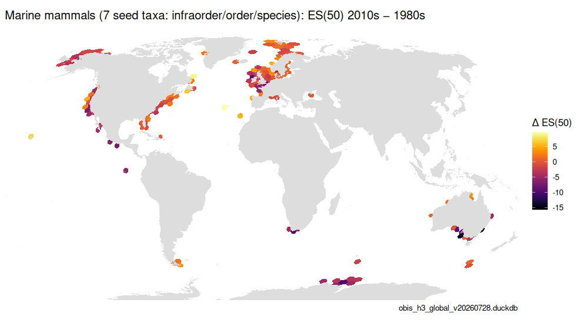
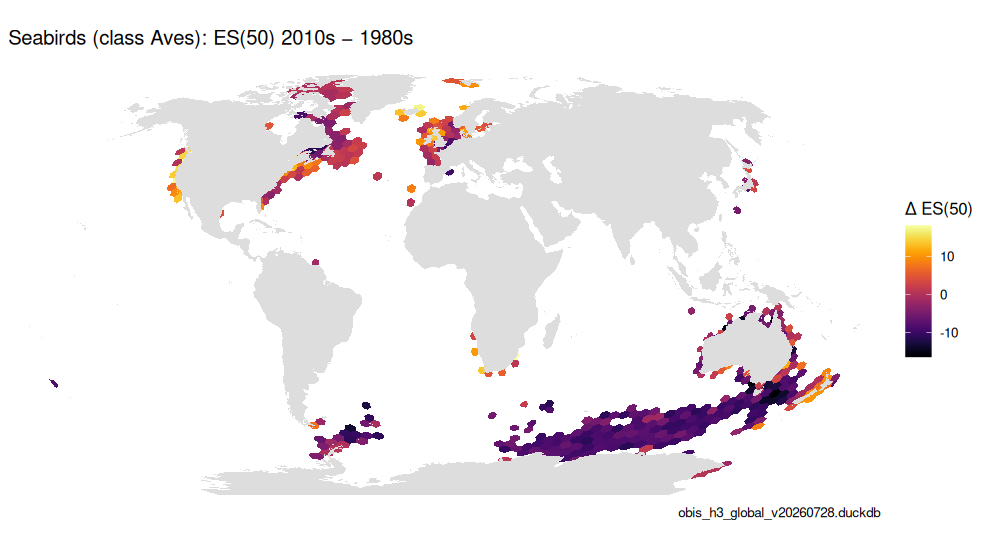
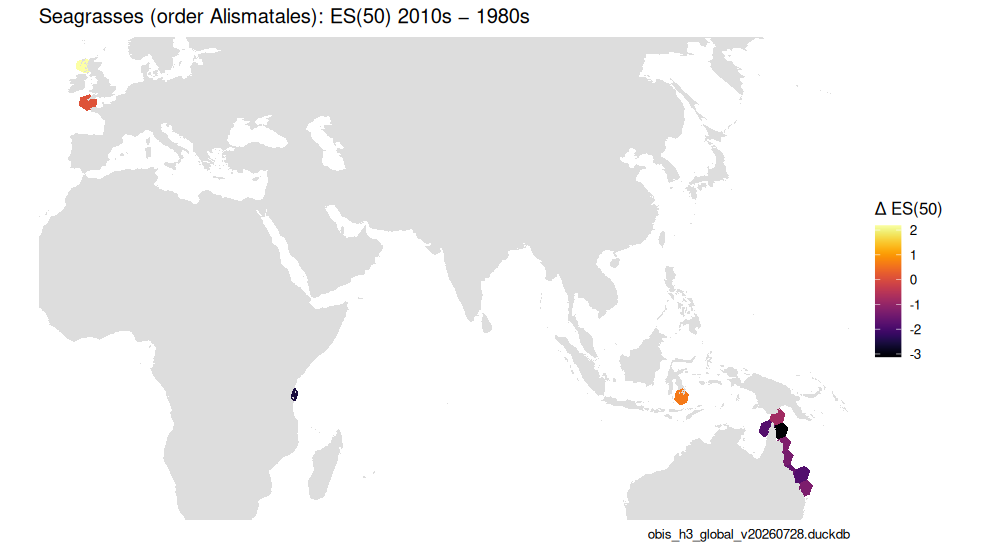
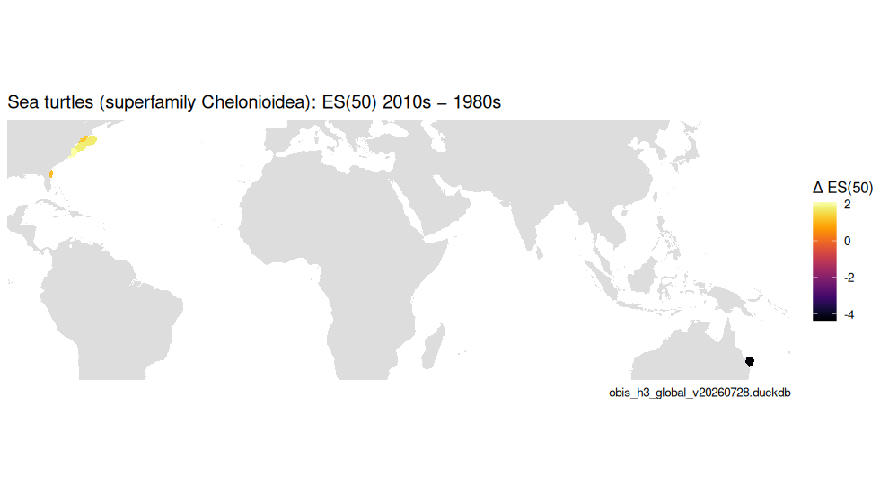

`occ_h3` carries the year of each record, so any indicator can be computed per
period and cell. This article does that per decade for each Essential Ocean
Variable and maps where ES(50) changed between two decades — Figure 5 of the
OBIS → H3 → EOV manuscript. It is the store-backed counterpart of
[`vignette("temporal_subsets")`](temporal_subsets.html), which does the same on
the shipped `occ_*` samples in memory.

Two rules keep the comparison honest. ES(50) needs at least 50 records in a
cell-decade to be reliable, so the "reliable cells" count is reported alongside
the raw record count. And change is only computed where **both** decades are
reliable (`calc_period_change()`), so a map of Δ ES(50) never mixes "fewer
species" with "fewer surveys".


``` r
library(obisindicators)
library(dplyr)
library(ggplot2)

con <- obis_store_connect()   # the store named by OBIS_H3_DUCKDB
```


> **Precomputed.** The store is not available where this documentation is
> built, so the chunks below were run locally by
> `data-raw/precompute_articles.R` and their output committed. This render used
> **obis_h3_global_v20260728.duckdb**, the global store.

## Indicators per decade and cell

A coarser resolution (H3 2) than the maps in
[`vignette("eov")`](eov.html), because splitting records across seven decades
thins each cell (see [`vignette("scaling")`](scaling.html)).


``` r
starts <- seq(1960L, 2020L, by = 10L)
pd <- bind_rows(lapply(EOV_ORDER, function(e) {
  d <- calc_period_indicators(con, res = RES_TIME, eov = e, starts = starts, esn = 50L)
  if (nrow(d)) cbind(eov = e, d) else NULL
}))
summ <- pd |>
  group_by(eov, period) |>
  summarize(cells = n(), cells_reliable = sum(n >= 50), records = sum(as.numeric(n)),
            median_es = median(es[n >= 50], na.rm = TRUE), .groups = "drop")
knitr::kable(summ |> mutate(median_es = round(median_es, 2)),
             caption = sprintf("Per-decade coverage and ES(50) by EOV, H3 resolution %d", RES_TIME))
```


Table: Per-decade coverage and ES(50) by EOV, H3 resolution 2

|eov           | period| cells| cells_reliable|  records| median_es|
|:-------------|------:|-----:|--------------:|--------:|---------:|
|fish          |   1960|  2621|            569|   873166|     31.75|
|fish          |   1970|  2048|            699|  1729628|     30.91|
|fish          |   1980|  1855|            647|  4493283|     25.25|
|fish          |   1990|  1983|            770|  7673014|     22.14|
|fish          |   2000|  2405|           1075| 11180145|     22.14|
|fish          |   2010|  1727|            732| 14529812|     20.05|
|fish          |   2020|   611|            369|  5919572|     15.48|
|hardCorals    |   1960|   429|             39|     9178|     19.37|
|hardCorals    |   1970|   395|             73|    16975|     21.54|
|hardCorals    |   1980|   406|            100|    25819|     28.00|
|hardCorals    |   1990|   452|            135|   108106|     22.07|
|hardCorals    |   2000|   531|            194|   285517|     14.44|
|hardCorals    |   2010|   438|            177|   350381|      8.88|
|hardCorals    |   2020|   149|             38|    29324|      9.45|
|mangroves     |   1960|    18|              4|      474|     15.81|
|mangroves     |   1970|    21|              8|     1330|     14.79|
|mangroves     |   1980|    28|              9|     1234|     18.67|
|mangroves     |   1990|    47|             12|     8180|      8.46|
|mangroves     |   2000|    42|             24|    41486|      2.75|
|mangroves     |   2010|    42|             16|    34009|      3.67|
|mangroves     |   2020|    21|              2|     1516|      2.68|
|marineMammals |   1960|   353|             41|    31254|      3.14|
|marineMammals |   1970|   456|             69|    40500|      4.97|
|marineMammals |   1980|   794|            174|    79937|      6.56|
|marineMammals |   1990|  1309|            462|   420446|      2.95|
|marineMammals |   2000|  1992|           1010|  1539634|      2.00|
|marineMammals |   2010|  1874|            923|  1949809|      2.00|
|marineMammals |   2020|   841|            236|   566727|      3.50|
|seaTurtles    |   1960|    44|              5|     1215|      1.00|
|seaTurtles    |   1970|    68|              7|     2278|      4.00|
|seaTurtles    |   1980|    98|              7|     2373|      2.00|
|seaTurtles    |   1990|   631|            120|    26627|      1.00|
|seaTurtles    |   2000|  2023|            252|    69536|      1.80|
|seaTurtles    |   2010|  1497|            348|   264713|      1.00|
|seaTurtles    |   2020|   203|             25|    72599|      1.08|
|seabirds      |   1960|   447|             87|   105855|     11.49|
|seabirds      |   1970|   796|            226|   261923|     12.33|
|seabirds      |   1980|  1166|            465|  1921326|     13.00|
|seabirds      |   1990|  1890|            646|  2292579|      9.75|
|seabirds      |   2000|  3815|           1509|  2557880|      5.90|
|seabirds      |   2010|  4277|           1852|  8322502|      7.68|
|seabirds      |   2020|  2950|           1222|  7696206|     18.55|
|seagrasses    |   1960|    23|              2|      659|      2.50|
|seagrasses    |   1970|    52|              3|      703|      7.87|
|seagrasses    |   1980|    89|             18|     4380|      6.94|
|seagrasses    |   1990|   111|             25|    30889|      4.35|
|seagrasses    |   2000|   192|             66|    80068|      3.80|
|seagrasses    |   2010|   326|             94|   141857|      3.88|
|seagrasses    |   2020|   309|             83|    51186|      3.23|


``` r
long <- bind_rows(
  transmute(summ, eov, period, metric = "cells reliable (n ≥ 50)", value = cells_reliable),
  transmute(summ, eov, period, metric = "records", value = records),
  transmute(summ, eov, period, metric = "median ES(50)", value = median_es))
p <- ggplot(long, aes(x = period, y = value, color = eov)) +
  geom_line() + geom_point(size = 1.5) +
  facet_wrap(~ metric, scales = "free_y") +
  labs(x = "decade", y = NULL, color = NULL, title = "Per-decade coverage and ES(50) by EOV",
       caption = store_label) +
  theme_minimal(base_size = 11) + theme(legend.position = "bottom")
p
```

<div class="figure">

<p class="caption">plot of chunk fig5a</p>
</div>


Records climb steeply into the 2000s and 2010s for every EOV — that is
observation effort, not biodiversity — which is exactly why the change maps
below gate on reliability in both decades rather than comparing raw counts.

## Change maps, 1980s → 2010s

`calc_period_change()` returns the per-cell difference for cells reliable in
both decades, plus a coverage summary (cells reliable only in one decade or the
other are reported, not mapped).


``` r
for (e in unique(pd$eov)) {
  ch <- calc_period_change(filter(pd, eov == e), from = 1980L, to = 2010L, esn = 50L)
  if (nrow(ch$cells) < 3) next
  cat("\n\n### ", obis_eov_label(e), " — cells reliable in both: ", ch$coverage$both,
      " (only 1980s: ", ch$coverage$only_from, "; only 2010s: ", ch$coverage$only_to, ")\n\n", sep = "")
  p <- gmap_cells(ch$cells, "delta", label = "Δ ES(50)") +
    labs(title = paste0(obis_eov_label(e, max_taxa = 1L), ": ES(50) 2010s − 1980s"),
         caption = store_label)
  save_fig(p, paste0("fig5b_change_", e), ch$cells, width = 9, height = 5)
  print(p)
}
```


### Fish (Agnatha, Chondrichthyes, Osteichthyes) — cells reliable in both: 387 (only 1980s: 260; only 2010s: 345)


### Hard corals (order Scleractinia) — cells reliable in both: 43 (only 1980s: 57; only 2010s: 134)

<div class="figure">

<p class="caption">plot of chunk fig5b</p>
</div>

### Mangroves (19 seed taxa: family/genus) — cells reliable in both: 4 (only 1980s: 5; only 2010s: 12)

<div class="figure">

<p class="caption">plot of chunk fig5b</p>
</div>

### Marine mammals (7 seed taxa: infraorder/order/species) — cells reliable in both: 141 (only 1980s: 33; only 2010s: 782)

<div class="figure">

<p class="caption">plot of chunk fig5b</p>
</div>

### Seabirds (class Aves) — cells reliable in both: 408 (only 1980s: 57; only 2010s: 1444)

<div class="figure">

<p class="caption">plot of chunk fig5b</p>
</div>

### Seagrasses (order Alismatales) — cells reliable in both: 13 (only 1980s: 5; only 2010s: 81)

<div class="figure">

<p class="caption">plot of chunk fig5b</p>
</div>

### Sea turtles (superfamily Chelonioidea) — cells reliable in both: 6 (only 1980s: 1; only 2010s: 342)

<div class="figure">

<p class="caption">plot of chunk fig5b</p>
</div><div class="figure">

<p class="caption">plot of chunk fig5b</p>
</div>

EOVs with fewer than three cells reliable in both decades are skipped — on a
regional demo store that is most of them; the global store fills in the rest.


``` r
DBI::dbDisconnect(con, shutdown = TRUE)
```
