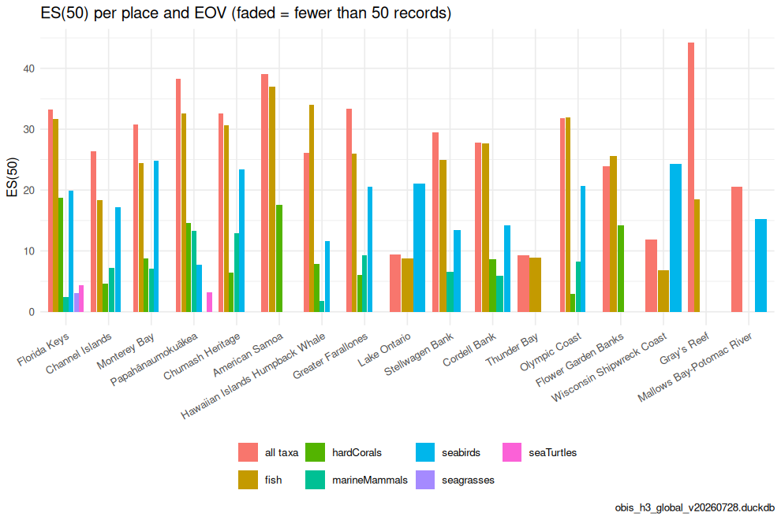

Managers ask about places — a National Marine Sanctuary, an EEZ, a proposed
protected area — not hexagons. Because every record in the store is already
binned to fine H3 cells, a place is just a set of cells: `place_cells()` fills
each polygon with cells at a chosen resolution, and `calc_place_indicators()`
pools the species counts of those cells and computes the indicators with the
same `calc_indicators()` reference used everywhere else. This is Figure 6 of
the OBIS → H3 → EOV manuscript, and the pattern behind the
[MarineSensitivity](https://marinesensitivity.org) place summaries.


``` r
library(obisindicators)
library(dplyr)
library(ggplot2)
library(sf)

con <- obis_store_connect()   # the store named by OBIS_H3_DUCKDB
```


> **Precomputed.** The store is not available where this documentation is
> built, so the chunks below were run locally by
> `data-raw/precompute_articles.R` and their output committed. This render used
> **obis_h3_global_v20260728.duckdb**, the global store.

## The places

Any `sf` polygons work. Here: a GeoPackage named by `PLACES_GPKG` if set,
otherwise the U.S. National Marine Sanctuaries from
[`onmsR`](https://noaa-onms.github.io/onmsR/), otherwise three demo boxes.
Places that do not touch the store's footprint are dropped.


``` r
places_path <- Sys.getenv("PLACES_GPKG")
places <- if (nzchar(places_path) && file.exists(places_path)) {
  st_read(places_path, quiet = TRUE)
} else if (requireNamespace("onmsR", quietly = TRUE)) {
  onmsR::sanctuaries
} else {
  bx <- function(n, xmin, ymin, xmax, ymax) st_sf(name = n, geometry = st_as_sfc(
    st_bbox(c(xmin = xmin, ymin = ymin, xmax = xmax, ymax = ymax), crs = st_crs(4326))))
  rbind(bx("Florida Keys", -83, 24, -80, 26), bx("NW Gulf", -97, 26, -90, 30),
        bx("Lesser Antilles", -64, 12, -60, 18))
}
name_col <- intersect(c("sanctuary", "name", "NAME", "nms"), names(places))[1]
res_p    <- as.integer(Sys.getenv("PAPER_RES_PLACE", "6"))

# keep places that intersect the store's footprint (occupied cells at res 2)
foot   <- hex_sf(obis_cell_indicators(con, 2)$cell)
places <- places[lengths(st_intersects(st_transform(places, 4326), foot)) > 0, ]
places[[name_col]]
#>  [1] "Cordell Bank"                    "Chumash Heritage"               
#>  [3] "Channel Islands"                 "Flower Garden Banks"            
#>  [5] "Florida Keys"                    "Greater Farallones"             
#>  [7] "Gray's Reef"                     "Hawaiian Islands Humpback Whale"
#>  [9] "Lake Ontario"                    "Monterey Bay"                   
#> [11] "Mallows Bay-Potomac River"       "Monitor"                        
#> [13] "American Samoa"                  "Olympic Coast"                  
#> [15] "Papahānaumokuākea"               "Stellwagen Bank"                
#> [17] "Thunder Bay"                     "Wisconsin Shipwreck Coast"
```

## Indicators per place and EOV

Each place is filled with H3 res 6 cells (`n_cells`), of which
`n_cells_occupied` hold records; `n`, `sp`, `es` and the Hill numbers are then
computed on the pooled records — for all taxa and for each EOV.


``` r
pi <- bind_rows(lapply(c("all taxa", EOV_ORDER), function(e) {
  d <- calc_place_indicators(con, places, name_col, res = res_p,
                             eov = if (e == "all taxa") NULL else e, esn = 50L)
  cbind(group = e, d)
}))
knitr::kable(
  pi |> select(group, place, n_cells, n_cells_occupied, n, sp, es, hill_1) |>
    mutate(es = round(es, 2), hill_1 = round(hill_1, 2)),
  caption = sprintf("Indicators per place and EOV (fill resolution H3 %d)", res_p))
```


Table: Indicators per place and EOV (fill resolution H3 6)

|group         |place                           | n_cells| n_cells_occupied|       n|   sp|    es| hill_1|
|:-------------|:-------------------------------|-------:|----------------:|-------:|----:|-----:|------:|
|all taxa      |American Samoa                  |     927|               18|   74285|  821| 39.03| 147.83|
|all taxa      |Channel Islands                 |      97|               97| 1773440| 2063| 26.31|  36.86|
|all taxa      |Chumash Heritage                |     300|              297|  295407| 2246| 32.62|  87.50|
|all taxa      |Cordell Bank                    |      89|               88|   31104|  891| 27.85|  61.04|
|all taxa      |Florida Keys                    |     303|              296| 1321656| 4338| 33.23|  91.41|
|all taxa      |Flower Garden Banks             |       8|                8|    6746|  340| 23.85|  40.47|
|all taxa      |Gray's Reef                     |       2|                2|    8430|  790| 44.25| 306.79|
|all taxa      |Greater Farallones              |     233|              230|  118860| 2007| 33.36| 109.45|
|all taxa      |Hawaiian Islands Humpback Whale |      86|               86|   91467| 2023| 26.16|  48.49|
|all taxa      |Lake Ontario                    |     116|               75|   21670|   80|  9.38|   6.34|
|all taxa      |Mallows Bay-Potomac River       |       1|                1|      98|   30| 20.51|  14.31|
|all taxa      |Monterey Bay                    |     417|              414| 1506459| 3323| 30.81|  73.95|
|all taxa      |Olympic Coast                   |     265|              259|   17665|  891| 31.84|  98.96|
|all taxa      |Papahānaumokuākea               |   39394|             5462|  331120| 2803| 38.27| 155.07|
|all taxa      |Stellwagen Bank                 |      61|               61|   34627|  636| 29.52|  62.20|
|all taxa      |Thunder Bay                     |     282|              118|    7787|   44|  9.24|   7.23|
|all taxa      |Wisconsin Shipwreck Coast       |      65|               42|    2832|   68| 11.83|   9.01|
|fish          |American Samoa                  |     927|                9|   63435|  456| 37.01| 111.05|
|fish          |Channel Islands                 |      97|               90|  200106|  316| 18.37|  21.36|
|fish          |Chumash Heritage                |     300|              234|   42512|  395| 30.63|  65.36|
|fish          |Cordell Bank                    |      89|               47|    2063|  153| 27.72|  47.77|
|fish          |Florida Keys                    |     303|              244| 1249798|  839| 31.71|  66.79|
|fish          |Flower Garden Banks             |       8|                6|     282|   62| 25.64|  32.99|
|fish          |Gray's Reef                     |       2|                2|     376|   57| 18.44|  17.55|
|fish          |Greater Farallones              |     233|              148|   23751|  312| 26.01|  44.62|
|fish          |Hawaiian Islands Humpback Whale |      86|               66|   32483|  447| 34.05|  88.42|
|fish          |Lake Ontario                    |     116|               73|   21342|   32|  8.70|   5.74|
|fish          |Mallows Bay-Potomac River       |       1|                1|       2|    1|    NA|   1.00|
|fish          |Monterey Bay                    |     417|              314|  128489|  477| 24.39|  34.96|
|fish          |Olympic Coast                   |     265|              153|    2664|  161| 31.96|  64.79|
|fish          |Papahānaumokuākea               |   39394|              427|  205124|  789| 32.55|  72.84|
|fish          |Stellwagen Bank                 |      61|               61|   10136|   83| 24.97|  33.38|
|fish          |Thunder Bay                     |     282|              110|    7738|   25|  8.95|   6.93|
|fish          |Wisconsin Shipwreck Coast       |      65|               34|    2489|   16|  6.80|   5.04|
|hardCorals    |American Samoa                  |     927|                9|    7275|  121| 17.53|  17.94|
|hardCorals    |Channel Islands                 |      97|               29|    1039|   12|  4.68|   3.31|
|hardCorals    |Chumash Heritage                |     300|                8|      86|    7|  6.48|   4.70|
|hardCorals    |Cordell Bank                    |      89|                8|      61|    9|  8.60|   4.88|
|hardCorals    |Florida Keys                    |     303|              130|   23147|   79| 18.71|  19.59|
|hardCorals    |Flower Garden Banks             |       8|                7|    4839|   37| 14.18|  13.89|
|hardCorals    |Gray's Reef                     |       2|                1|      17|    4|    NA|   2.50|
|hardCorals    |Greater Farallones              |     233|               12|      55|    6|  6.00|   5.59|
|hardCorals    |Hawaiian Islands Humpback Whale |      86|               46|   15418|   72|  7.89|   6.38|
|hardCorals    |Lake Ontario                    |     116|                0|      NA|   NA|    NA|     NA|
|hardCorals    |Mallows Bay-Potomac River       |       1|                0|      NA|   NA|    NA|     NA|
|hardCorals    |Monterey Bay                    |     417|               39|     376|   13|  8.80|   5.72|
|hardCorals    |Olympic Coast                   |     265|                7|     333|    4|  2.96|   1.77|
|hardCorals    |Papahānaumokuākea               |   39394|              178|   50052|  109| 14.61|  13.33|
|hardCorals    |Stellwagen Bank                 |      61|                0|      NA|   NA|    NA|     NA|
|hardCorals    |Thunder Bay                     |     282|                0|      NA|   NA|    NA|     NA|
|hardCorals    |Wisconsin Shipwreck Coast       |      65|                0|      NA|   NA|    NA|     NA|
|mangroves     |American Samoa                  |     927|                0|      NA|   NA|    NA|     NA|
|mangroves     |Channel Islands                 |      97|                0|      NA|   NA|    NA|     NA|
|mangroves     |Chumash Heritage                |     300|                0|      NA|   NA|    NA|     NA|
|mangroves     |Cordell Bank                    |      89|                0|      NA|   NA|    NA|     NA|
|mangroves     |Florida Keys                    |     303|                0|      NA|   NA|    NA|     NA|
|mangroves     |Flower Garden Banks             |       8|                0|      NA|   NA|    NA|     NA|
|mangroves     |Gray's Reef                     |       2|                0|      NA|   NA|    NA|     NA|
|mangroves     |Greater Farallones              |     233|                0|      NA|   NA|    NA|     NA|
|mangroves     |Hawaiian Islands Humpback Whale |      86|                0|      NA|   NA|    NA|     NA|
|mangroves     |Lake Ontario                    |     116|                0|      NA|   NA|    NA|     NA|
|mangroves     |Mallows Bay-Potomac River       |       1|                0|      NA|   NA|    NA|     NA|
|mangroves     |Monterey Bay                    |     417|                0|      NA|   NA|    NA|     NA|
|mangroves     |Olympic Coast                   |     265|                0|      NA|   NA|    NA|     NA|
|mangroves     |Papahānaumokuākea               |   39394|                0|      NA|   NA|    NA|     NA|
|mangroves     |Stellwagen Bank                 |      61|                0|      NA|   NA|    NA|     NA|
|mangroves     |Thunder Bay                     |     282|                0|      NA|   NA|    NA|     NA|
|mangroves     |Wisconsin Shipwreck Coast       |      65|                0|      NA|   NA|    NA|     NA|
|marineMammals |American Samoa                  |     927|                2|       2|    1|    NA|   1.00|
|marineMammals |Channel Islands                 |      97|               97|   10069|   22|  7.21|   5.12|
|marineMammals |Chumash Heritage                |     300|              259|    3518|   25| 12.88|  10.41|
|marineMammals |Cordell Bank                    |      89|               84|    3172|   17|  5.94|   3.04|
|marineMammals |Florida Keys                    |     303|               52|     775|    6|  2.44|   2.09|
|marineMammals |Flower Garden Banks             |       8|                1|       1|    1|    NA|   1.00|
|marineMammals |Gray's Reef                     |       2|                2|      16|    2|    NA|   1.46|
|marineMammals |Greater Farallones              |     233|              216|    6716|   28|  9.24|   4.63|
|marineMammals |Hawaiian Islands Humpback Whale |      86|               86|   33027|   10|  1.82|   1.13|
|marineMammals |Lake Ontario                    |     116|                0|      NA|   NA|    NA|     NA|
|marineMammals |Mallows Bay-Potomac River       |       1|                0|      NA|   NA|    NA|     NA|
|marineMammals |Monterey Bay                    |     417|              388|   78950|   26|  7.03|   3.66|
|marineMammals |Olympic Coast                   |     265|              220|    2477|   17|  8.22|   3.67|
|marineMammals |Papahānaumokuākea               |   39394|              615|     728|   25| 13.29|   9.71|
|marineMammals |Stellwagen Bank                 |      61|               61|   13557|   16|  6.56|   4.20|
|marineMammals |Thunder Bay                     |     282|                0|      NA|   NA|    NA|     NA|
|marineMammals |Wisconsin Shipwreck Coast       |      65|                0|      NA|   NA|    NA|     NA|
|seabirds      |American Samoa                  |     927|                3|      12|    8|    NA|   7.56|
|seabirds      |Channel Islands                 |      97|               95|   10946|   97| 17.14|  13.95|
|seabirds      |Chumash Heritage                |     300|              265|   15825|  126| 23.43|  31.08|
|seabirds      |Cordell Bank                    |      89|               86|    4918|   57| 14.20|  13.14|
|seabirds      |Florida Keys                    |     303|              178|    4344|   68| 19.91|  20.24|
|seabirds      |Flower Garden Banks             |       8|                1|       1|    1|    NA|   1.00|
|seabirds      |Gray's Reef                     |       2|                1|       2|    1|    NA|   1.00|
|seabirds      |Greater Farallones              |     233|              226|   20793|  131| 20.61|  22.83|
|seabirds      |Hawaiian Islands Humpback Whale |      86|               50|    3263|   34| 11.63|   9.92|
|seabirds      |Lake Ontario                    |     116|               25|     327|   47| 21.02|  21.45|
|seabirds      |Mallows Bay-Potomac River       |       1|                1|      81|   20| 15.21|   8.90|
|seabirds      |Monterey Bay                    |     417|              392|   50108|  147| 24.80|  35.08|
|seabirds      |Olympic Coast                   |     265|              180|    4814|   86| 20.65|  23.64|
|seabirds      |Papahānaumokuākea               |   39394|             4169|   10234|   73|  7.75|   4.23|
|seabirds      |Stellwagen Bank                 |      61|               61|    4743|   58| 13.48|  11.75|
|seabirds      |Thunder Bay                     |     282|               17|      49|   19|    NA|  13.66|
|seabirds      |Wisconsin Shipwreck Coast       |      65|               16|     343|   52| 24.28|  28.78|
|seagrasses    |American Samoa                  |     927|                0|      NA|   NA|    NA|     NA|
|seagrasses    |Channel Islands                 |      97|                8|      18|    1|    NA|   1.00|
|seagrasses    |Chumash Heritage                |     300|                5|      21|    1|    NA|   1.00|
|seagrasses    |Cordell Bank                    |      89|                0|      NA|   NA|    NA|     NA|
|seagrasses    |Florida Keys                    |     303|                9|     411|    4|  3.11|   2.38|
|seagrasses    |Flower Garden Banks             |       8|                0|      NA|   NA|    NA|     NA|
|seagrasses    |Gray's Reef                     |       2|                0|      NA|   NA|    NA|     NA|
|seagrasses    |Greater Farallones              |     233|                5|      21|    4|    NA|   2.71|
|seagrasses    |Hawaiian Islands Humpback Whale |      86|                1|       2|    1|    NA|   1.00|
|seagrasses    |Lake Ontario                    |     116|                0|      NA|   NA|    NA|     NA|
|seagrasses    |Mallows Bay-Potomac River       |       1|                0|      NA|   NA|    NA|     NA|
|seagrasses    |Monterey Bay                    |     417|               11|      34|    3|    NA|   1.88|
|seagrasses    |Olympic Coast                   |     265|                1|       4|    1|    NA|   1.00|
|seagrasses    |Papahānaumokuākea               |   39394|                2|       2|    1|    NA|   1.00|
|seagrasses    |Stellwagen Bank                 |      61|                0|      NA|   NA|    NA|     NA|
|seagrasses    |Thunder Bay                     |     282|                0|      NA|   NA|    NA|     NA|
|seagrasses    |Wisconsin Shipwreck Coast       |      65|                0|      NA|   NA|    NA|     NA|
|seaTurtles    |American Samoa                  |     927|                0|      NA|   NA|    NA|     NA|
|seaTurtles    |Channel Islands                 |      97|                0|      NA|   NA|    NA|     NA|
|seaTurtles    |Chumash Heritage                |     300|                5|       5|    2|    NA|   1.65|
|seaTurtles    |Cordell Bank                    |      89|                0|      NA|   NA|    NA|     NA|
|seaTurtles    |Florida Keys                    |     303|               68|     157|    5|  4.35|   2.51|
|seaTurtles    |Flower Garden Banks             |       8|                0|      NA|   NA|    NA|     NA|
|seaTurtles    |Gray's Reef                     |       2|                2|      10|    3|    NA|   2.57|
|seaTurtles    |Greater Farallones              |     233|                9|       9|    1|    NA|   1.00|
|seaTurtles    |Hawaiian Islands Humpback Whale |      86|               18|      39|    1|    NA|   1.00|
|seaTurtles    |Lake Ontario                    |     116|                0|      NA|   NA|    NA|     NA|
|seaTurtles    |Mallows Bay-Potomac River       |       1|                0|      NA|   NA|    NA|     NA|
|seaTurtles    |Monterey Bay                    |     417|               14|      19|    1|    NA|   1.00|
|seaTurtles    |Olympic Coast                   |     265|                7|      10|    1|    NA|   1.00|
|seaTurtles    |Papahānaumokuākea               |   39394|              389|     466|    4|  3.26|   2.38|
|seaTurtles    |Stellwagen Bank                 |      61|                3|       4|    2|    NA|   2.00|
|seaTurtles    |Thunder Bay                     |     282|                0|      NA|   NA|    NA|     NA|
|seaTurtles    |Wisconsin Shipwreck Coast       |      65|                0|      NA|   NA|    NA|     NA|


``` r
d <- pi |> filter(!is.na(n)) |>
  mutate(reliable = n >= 50, place = reorder(place, -n))
p <- ggplot(d, aes(x = place, y = es, fill = group, alpha = reliable)) +
  geom_col(position = position_dodge(width = .85), width = .8) +
  scale_alpha_manual(values = c(`TRUE` = 1, `FALSE` = .35), guide = "none") +
  labs(x = NULL, y = "ES(50)", fill = NULL,
       title = "ES(50) per place and EOV (faded = fewer than 50 records)",
       caption = store_label) +
  theme_minimal(base_size = 11) +
  theme(legend.position = "bottom", axis.text.x = element_text(angle = 30, hjust = 1))
p
```

<div class="figure">

<p class="caption">plot of chunk fig6</p>
</div>


## Where the places sit

The places over the all-taxa ES(50) surface (H3 3, masked to cells
with at least 50 records):


``` r
allr  <- obis_cell_indicators(con, RES_MAP)
robin <- "+proj=robin +lon_0=0 +x_0=0 +y_0=0 +ellps=WGS84 +datum=WGS84 +units=m +no_defs"
bb    <- st_bbox(st_transform(hex_sf(allr$cell), robin))
p <- gmap_cells(allr, "es", label = "ES(50)", mask = allr$n >= 50) +
  geom_sf(data = st_transform(places, 4326), fill = NA, color = "cyan", linewidth = .4) +
  # re-assert the frame: an added sf layer otherwise widens coord_sf to the world
  coord_sf(crs = robin, xlim = bb[c("xmin", "xmax")], ylim = bb[c("ymin", "ymax")]) +
  labs(title = sprintf("Places over the all-taxa ES(50) surface (res %d)", RES_MAP), caption = store_label)
p
```

<div class="figure">

<p class="caption">plot of chunk fig6-map</p>
</div>


``` r
DBI::dbDisconnect(con, shutdown = TRUE)
```
