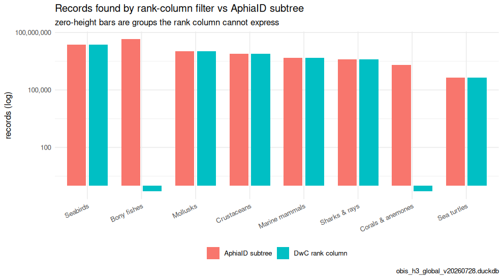
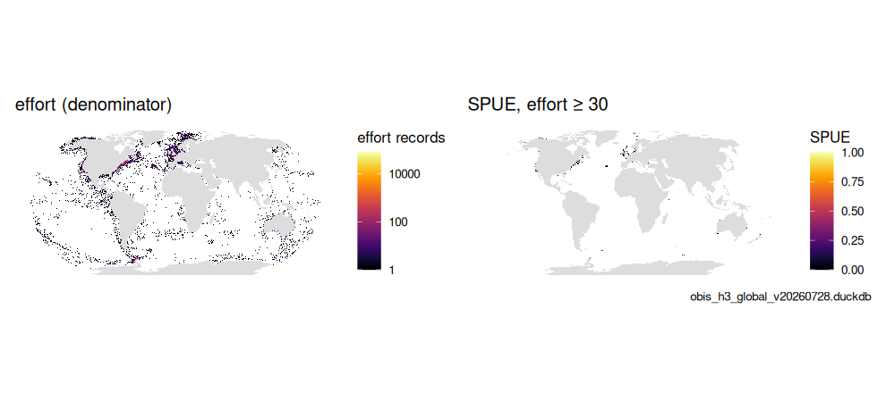
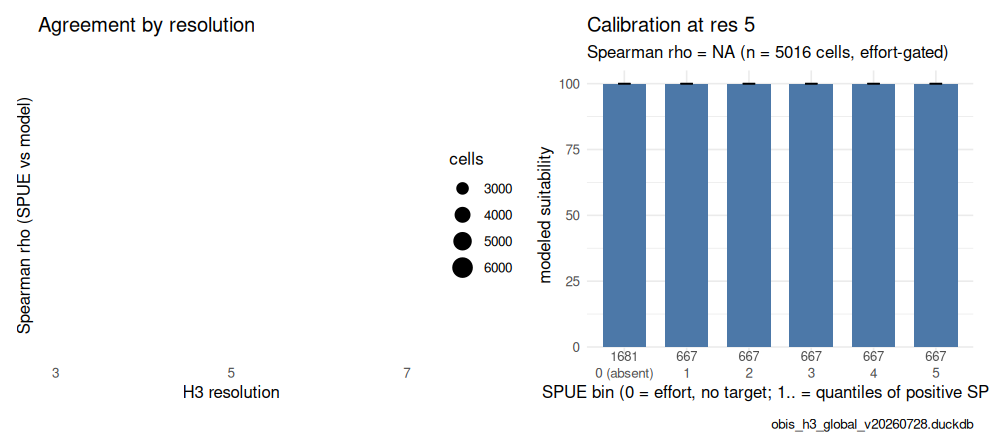
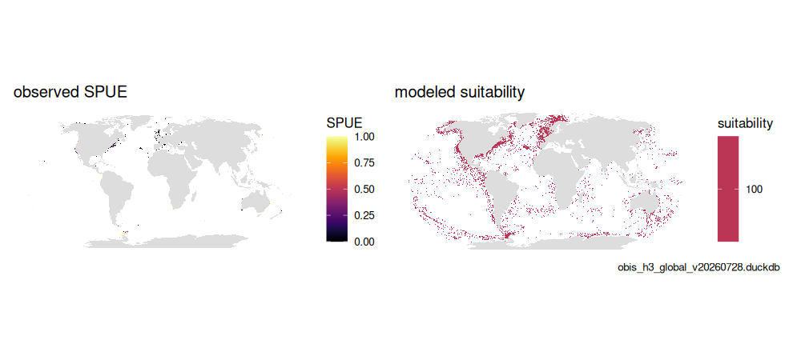

This article shows how to filter OBIS by **any WoRMS taxon, at any rank**, using
only the local OBIS snapshot — no calls to the (heavy) OBIS web services — and
how to turn a higher-order taxon into an **observation-effort proxy** for a
presence-only sightings-per-unit-effort (SPUE) indicator. Along the way it
produces Table 3 and Figure 4 of the OBIS → H3 → EOV manuscript.

It builds on [`vignette("h3t")`](h3t.html): the same `occ_h3` species-level
store, plus a baked **`taxon`** table (the WoRMS taxonomy) that lets us resolve
the descendants of an arbitrary AphiaID.

## Why a `taxon` table?

`occ_h3` carries only the six Darwin Core rank columns (`phylum` … `species`)
plus the species-level `aphiaid`. That is enough to filter on, say,
`class = "Aves"`, but **not** on a rank that isn't a column — e.g. Infraorder
*Cetacea*, or an arbitrary clade referenced only by its AphiaID. To support
those we walk the full WoRMS hierarchy:

- `build_taxon_parquet.R` extracts `taxonID` (= AphiaID), `parentNameUsageID`,
  `acceptedNameUsageID`, `scientificName`, `taxonRank` from a WoRMS DarwinCore
  `taxon.txt` into a compact `taxon.parquet`.
- `migrate_add_taxon.R` bakes that into `obis_h3.duckdb` (indexed on
  `parentNameUsageID`), alongside `occ_h3` / `idx_h3`. The bulk WoRMS download
  is not a complete cover of the AphiaIDs OBIS carries, so
  `obis_taxon_fill_gaps()` closes the gap from the WoRMS REST API (see
  [`vignette("eov")`](eov.html)).


``` r
library(obisindicators)
library(dplyr)
library(ggplot2)

con <- obis_store_connect()   # the store named by OBIS_H3_DUCKDB
```


> **Precomputed.** The store is not available where this documentation is
> built, so the database chunks below were run locally by
> `data-raw/precompute_articles.R` and their output committed (the tile maps
> are live). This render used **obis_h3_global_v20260728.duckdb**, the global store.

## Resolve the children of a taxon

`obis_taxon_children()` returns the seed taxon plus every descendant, at any
rank, via a recursive walk of `parentNameUsageID`. On the full WoRMS table
(~1.5 M rows) this resolves in a fraction of a second.


``` r
# Infraorder Cetacea = AphiaID 2688 (a rank that is NOT an occ_h3 column)
cet <- obis_taxon_children(2688, con)
nrow(cet)                              # descendant taxa
#> [1] 1665
sort(table(cet$taxonRank), decreasing = TRUE)
#> 
#>     Species       Genus  Subspecies      Family   Subfamily    Subgenus 
#>        1165         231         152          50          29          26 
#> Superfamily  Infraorder     Variety 
#>          10           1           1

# class Bacillariophyceae (diatoms) = 148899: a much broader subtree
dia <- obis_taxon_children(148899, con)
nrow(dia)
#> [1] 71531
```

The descendant AphiaIDs (`cet$taxonID`) are exactly the set used to filter
`occ_h3.aphiaid`. `obis_taxon_subtree_sql()` returns that resolution as a
standalone read-only `SELECT`, handy for the API.

## Rank columns vs. subtrees (Table 3)

Why not just filter on the Darwin Core rank columns? Because the rank a name
occupies is not stable across taxonomies. A user who filters
`class = 'Actinopterygii'` gets nothing: WoRMS files Actinopterygii as a
gigaclass and OBIS's `class` column carries Teleostei. `class = 'Anthozoa'`
likewise returns zero (a subphylum in WoRMS; OBIS uses Hexacorallia /
Octocorallia). The AphiaID subtree is rank-agnostic and immune to this.
`calc_rank_vs_subtree()` counts each preset group both ways on the base
resolution tier of `occ_h3`.


``` r
rv <- calc_rank_vs_subtree(con)
knitr::kable(
  rv |> mutate(across(c(records_rank, records_tree), ~ format(.x, big.mark = ",")),
               ratio = round(ratio, 3)),
  caption = "Records by Darwin Core rank-column filter vs. AphiaID subtree")
```


Table: Records by Darwin Core rank-column filter vs. AphiaID subtree

|label             |rank   |name           | aphiaid|records_rank | species_rank|records_tree | species_tree| ratio|
|:-----------------|:------|:--------------|-------:|:------------|------------:|:------------|------------:|-----:|
|Seabirds          |class  |Aves           |    1836|23,686,770   |          889|23,744,889   |          891| 0.998|
|Bony fishes       |class  |Actinopterygii |   10194|0            |            0|45,130,960   |        16477| 0.000|
|Sharks & rays     |class  |Elasmobranchii |   10193|4,001,773    |         1144|4,002,304    |         1145| 1.000|
|Marine mammals    |class  |Mammalia       |    1837|4,866,582    |          170|4,866,582    |          170| 1.000|
|Sea turtles       |order  |Testudines     |    2689|447,735      |           22|447,743      |           22| 1.000|
|Corals & anemones |class  |Anthozoa       |    1292|0            |            0|1,999,366    |         6258| 0.000|
|Mollusks          |phylum |Mollusca       |      51|10,733,645   |        34064|10,739,769   |        34079| 0.999|
|Crustaceans       |class  |Malacostraca   |    1071|7,669,820    |        23968|7,670,453    |        23987| 1.000|


``` r
long <- bind_rows(
  transmute(rv, label, method = "DwC rank column", records = records_rank),
  transmute(rv, label, method = "AphiaID subtree", records = records_tree))
p <- ggplot(long, aes(x = reorder(label, -records), y = pmax(records, 0.5), fill = method)) +
  geom_col(position = position_dodge(width = .8), width = .7) +
  scale_y_log10(labels = scales::label_comma()) +
  labs(x = NULL, y = "records (log)", fill = NULL,
       title = "Records found by rank-column filter vs AphiaID subtree",
       subtitle = "zero-height bars are groups the rank column cannot express",
       caption = store_label) +
  theme_minimal(base_size = 11) +
  theme(legend.position = "bottom", axis.text.x = element_text(angle = 25, hjust = 1))
p
```

<div class="figure">

<p class="caption">plot of chunk fig-table3</p>
</div>


## Map a taxon's records (any rank)

`obis_h3t_sql(aphiaid = ...)` builds a served tile query that filters `occ_h3`
to the subtree via a recursive CTE (the `h3t` validator permits
`WITH RECURSIVE`). `obis_h3t_url()` base64-encodes it into a tile URL.


``` r
sql <- obis_h3t_sql(indicator = "n", aphiaid = 2688)   # # records, all Cetacea
cat(sql)
#> WITH RECURSIVE taxon_tree AS (
#> SELECT taxonID, parentNameUsageID
#> FROM taxon
#> WHERE taxonID IN (2688)
#> UNION ALL
#> SELECT t.taxonID, t.parentNameUsageID
#> FROM taxon t
#> JOIN taxon_tree tt ON t.parentNameUsageID = tt.taxonID
#> WHERE t.parentNameUsageID IS NOT NULL), src AS (
#>   SELECT CAST(h3_cell_to_parent(cell_id, LEAST({{res}}, 7)) AS BIGINT) AS cell_id,
#>          species, SUM(records) AS ni
#>   FROM occ_h3
#>   WHERE res = CASE WHEN LEAST({{res}}, 7) <= 3 THEN 3 WHEN LEAST({{res}}, 7) <= 5 THEN 5 ELSE 7 END
#>     AND aphiaid IN (SELECT taxonID FROM taxon_tree)
#>   GROUP BY 1, 2)
#> SELECT cell_id, SUM(ni) AS value, SUM(ni) AS n FROM src GROUP BY cell_id

url <- obis_h3t_url(
  base_url  = "h3tiles://h3t.marinesensitivity.org/h3t/{z}/{x}/{y}.h3t",
  sql       = sql)
```

The map below is served live from the deployed tile service (global store):

```{r map-records}
library(obisindicators)
library(mapgl)
url <- obis_h3t_url(
  base_url = "h3tiles://h3t.marinesensitivity.org/h3t/{z}/{x}/{y}.h3t",
  sql      = obis_h3t_sql(indicator = "n", aphiaid = 2688))
maplibre(center = c(-40, 20), zoom = 1.5) |>
  add_h3t_source(id = "cet", tiles = url) |>
  add_fill_layer(
    id = "cet_fill", source = "cet", source_layer = "cet",
    fill_color = interpolate(
      column = "value", values = c(1, 1000),
      stops  = c("#3b528b", "#5ec962")))
```

## An effort proxy: sightings per unit effort (SPUE)

A raw record map conflates *abundance* with *observation effort* — a hexagon
lights up both where a species is common and where people looked hard. When
records come from multi-species surveys, a **higher-order taxon** gives a
presence-only proxy for that effort: within the footprint of, say, all Cetacea
(the surveys that could have recorded any whale/dolphin), what fraction of
records are the target species?

$$\text{SPUE}_{cell} = \frac{\text{records of the target taxon}}{\text{records of the effort taxon}}$$

`obis_spue_sql()` builds this as a served tile query (two recursive subtrees:
numerator = target, denominator = effort). `calc_spue()` is the pinned R
reference (see `test-spue-parity.R`), and `calc_spue_cells()` returns the same
per-cell table from a store at a fixed resolution.


``` r
# target: Tursiops truncatus (common bottlenose dolphin) = 137111
# effort: Infraorder Cetacea = 2688 (its multi-species-survey footprint)
spue_sql <- obis_spue_sql(num_aphiaid = 137111, den_aphiaid = 2688)
cat(spue_sql)
#> WITH RECURSIVE num_tree AS (
#> SELECT taxonID, parentNameUsageID
#> FROM taxon
#> WHERE taxonID IN (137111)
#> UNION ALL
#> SELECT t.taxonID, t.parentNameUsageID
#> FROM taxon t
#> JOIN num_tree tt ON t.parentNameUsageID = tt.taxonID
#> WHERE t.parentNameUsageID IS NOT NULL),
#> den_tree AS (
#> SELECT taxonID, parentNameUsageID
#> FROM taxon
#> WHERE taxonID IN (2688)
#> UNION ALL
#> SELECT t.taxonID, t.parentNameUsageID
#> FROM taxon t
#> JOIN den_tree tt ON t.parentNameUsageID = tt.taxonID
#> WHERE t.parentNameUsageID IS NOT NULL),
#> src AS (
#>   SELECT CAST(h3_cell_to_parent(cell_id, LEAST({{res}}, 7)) AS BIGINT) AS cell_id,
#>          -- COALESCE so an effort cell lacking the target reads 0, not NULL
#>          -- (matches calc_spue(): sum of no records is 0). presence-only:
#>          -- the target was absent *despite* effort here.
#>          COALESCE(SUM(records) FILTER (WHERE aphiaid IN (SELECT taxonID FROM num_tree)), 0) AS n_num,
#>          SUM(records) AS n_den
#>   FROM occ_h3
#>   WHERE res = CASE WHEN LEAST({{res}}, 7) <= 3 THEN 3 WHEN LEAST({{res}}, 7) <= 5 THEN 5 ELSE 7 END
#>     AND aphiaid IN (SELECT taxonID FROM den_tree)
#>   GROUP BY 1)
#> SELECT cell_id,
#>        n_num::DOUBLE / NULLIF(n_den, 0) AS value,
#>        n_den AS n
#> FROM src
```

```{r spue-map}
library(obisindicators)
library(mapgl)
spue_url <- obis_h3t_url(
  base_url = "h3tiles://h3t.marinesensitivity.org/h3t/{z}/{x}/{y}.h3t",
  sql      = obis_spue_sql(num_aphiaid = 137111, den_aphiaid = 2688))
maplibre(center = c(-40, 20), zoom = 1.5) |>
  add_h3t_source(id = "spue", tiles = spue_url) |>
  add_fill_layer(
    id = "spue_fill", source = "spue", source_layer = "spue",
    fill_color = interpolate(
      column = "value", values = c(0, 1),
      stops  = c("#440154", "#fde725")))
```

The tooltip `n` carries the **effort** count (denominator): a bright cell backed
by a large `n` is a robust SPUE; a bright cell over `n = 3` is noise. Choosing
the effort taxon is the analyst's call — the parent class or order is a sensible
default, but a survey-defined group (e.g. Cetacea, seabirds) is often better.
See [`vignette("scaling")`](scaling.html) for how the denominator's sparsity
behaves across H3 resolutions.

## SPUE on a map, and against a species distribution model (Fig. 4)

Humpback whale (*Megaptera novaeangliae*, AphiaID 137092) over all Cetacea.
The effort map is the denominator; the SPUE map is masked to cells with at
least `min_eff` effort records.


``` r
num_id  <- as.integer(Sys.getenv("SPUE_NUM", "137092"))
den_id  <- as.integer(strsplit(Sys.getenv("SPUE_DEN", "2688"), ",")[[1]])
min_eff <- as.integer(Sys.getenv("SPUE_MIN_EFFORT", "30"))

sp5 <- calc_spue_cells(con, num_id, den_id, res = 5)
```


``` r
p1 <- gmap_cells(sp5, "effort", label = "effort records", trans = "log10") +
  labs(title = "effort (denominator)")
p2 <- gmap_cells(sp5, "spue", label = "SPUE", mask = sp5$effort >= min_eff) +
  labs(title = sprintf("SPUE, effort ≥ %d", min_eff))
p <- patchwork::wrap_plots(p1, p2, ncol = 2) + patchwork::plot_annotation(caption = store_label)
p
```

<div class="figure">

<p class="caption">plot of chunk fig4a</p>
</div>


Is presence-only SPUE telling us anything about habitat? Compare it with an
independent modeled suitability surface for the same species: a GeoTIFF named
by `SDM_TIF` (here the MarineSensitivity merged AquaMaps/expert-range model).
`h3_raster_to_cells()` aggregates the raster to the same H3 cells and
`compare_spue_sdm()` reports an effort-gated Spearman correlation plus
calibration bins, at each resolution.


``` r
sdm_tif <- Sys.getenv("SDM_TIF")
has_sdm <- nzchar(sdm_tif) && file.exists(sdm_tif)
if (!has_sdm) message("set SDM_TIF to run the comparison; skipped")
```


``` r
r  <- terra::rast(sdm_tif)
# crop to the effort footprint (a global 0.05-degree raster is 26M pixels)
bb <- sf::st_bbox(hex_sf(sp5$cell))
r  <- terra::crop(r, terra::ext(bb[["xmin"]] - 1, bb[["xmax"]] + 1, bb[["ymin"]] - 1, bb[["ymax"]] + 1))
res_set <- c(3L, 5L, 7L)
runs <- lapply(res_set, function(rs) {
  spue <- calc_spue_cells(con, num_id, den_id, res = rs)
  sdm  <- h3_raster_to_cells(r, rs, cells = spue$cell)
  list(res = rs, cmp = compare_spue_sdm(spue, sdm, min_effort = min_eff, n_bins = 5L))
})
stats <- bind_rows(lapply(runs, function(x) cbind(res = x$res, x$cmp$stats)))
knitr::kable(stats |> mutate(across(where(is.numeric), ~ signif(.x, 3))),
             caption = "SPUE vs. modeled suitability by resolution")
```


Table: SPUE vs. modeled suitability by resolution

| res| n_cells| rho| p_value| frac_present|
|---:|-------:|---:|-------:|------------:|
|   3|    2140|  NA|      NA|        0.761|
|   5|    5020|  NA|      NA|        0.665|
|   7|    6580|  NA|      NA|        0.511|


``` r
p_rho <- ggplot(stats, aes(x = res, y = rho)) + geom_line() + geom_point(aes(size = n_cells)) +
  scale_x_continuous(breaks = res_set) +
  labs(x = "H3 resolution", y = "Spearman rho (SPUE vs model)", size = "cells",
       title = "Agreement by resolution") + theme_minimal(base_size = 11)
p_cal <- plot_spue_sdm(runs[[2]]$cmp) + labs(title = "Calibration at res 5")
p <- patchwork::wrap_plots(p_rho, p_cal, ncol = 2) + patchwork::plot_annotation(caption = store_label)
p
```

<div class="figure">

<p class="caption">plot of chunk fig4b</p>
</div>


``` r
sdm5 <- h3_raster_to_cells(r, 5, cells = sp5$cell)
p2 <- patchwork::wrap_plots(
  gmap_cells(sp5, "spue", label = "SPUE", mask = sp5$effort >= min_eff) + labs(title = "observed SPUE"),
  gmap_cells(sdm5, "value", label = "suitability") + labs(title = "modeled suitability"),
  ncol = 2) + patchwork::plot_annotation(caption = store_label)
p2
```

<div class="figure">

<p class="caption">plot of chunk fig4c</p>
</div>


On a regional demo store the effort-gated cell count is small and agreement is
weak; the point of the comparison is the *method* — the same effort gate that
makes SPUE trustworthy also decides how many cells can be compared at all, and
that number falls with resolution (see [`vignette("scaling")`](scaling.html)).


``` r
DBI::dbDisconnect(con, shutdown = TRUE)
```
